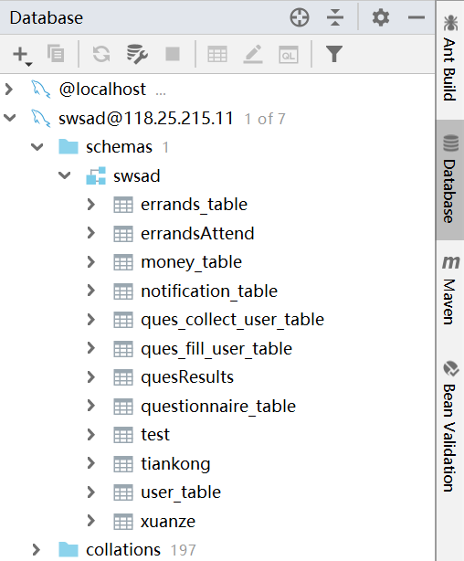

#### 系分个人报告

学号：15331419	姓名：郑超强

------

##### 任务

我的任务是后端问卷大部分和跑腿全部的api，相关点数据库设计和数据库设计文档

[数据库设计文档]: https://blog.csdn.net/weixin_37763226/article/details/93527507

##### 使用工具

IDEA 

- springboot+mybatis+restful风格的api
- 操作数据库
- 使用maven生成jar包

Postman 

- 测试接口是否正常，使用json数据包

MySQL 

- 数据库（可以用IDEA操作数据库 ）

宝塔面板 

- Linux/Windows服务器运维管理面板

##### Mybatis配置

连接数据库

指定映射的xml

解析实体类的名字

##### 设计过程

1.设计数据库

使用MySQL，根据前端的要求设计相关数据库

2.根据数据库写相关实体类

类写完私有变量后可以使用Generator自动生成get和set方法

get和set方法在xml文件中可以操作类的成员变量

4.设计接口类

5.创建xml文件，实现和数据库的交互

3.实现Controller并设计restful api

##### API设计

这是我在本地的postman，这里记录了我所有的api

问卷APIs

跑腿APIs

##### 数据库设计

EER图

##### 结语

通过一个学期的开发，我初步掌握了后端API的开发，一个web项目是怎么搭建的。学会了设计Springboot+Mybatis+restful风格的API，也接触到了IDEA这个非常棒的开发软件。

在挣闲钱系统中，作为一个后端开发者，在与前端和产品经理的交流中，我认识到了一个Web项目的开发过程，其中也有很多讨论，这让我收获很大。
