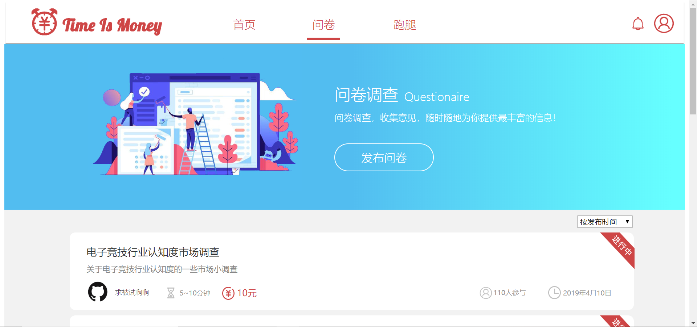
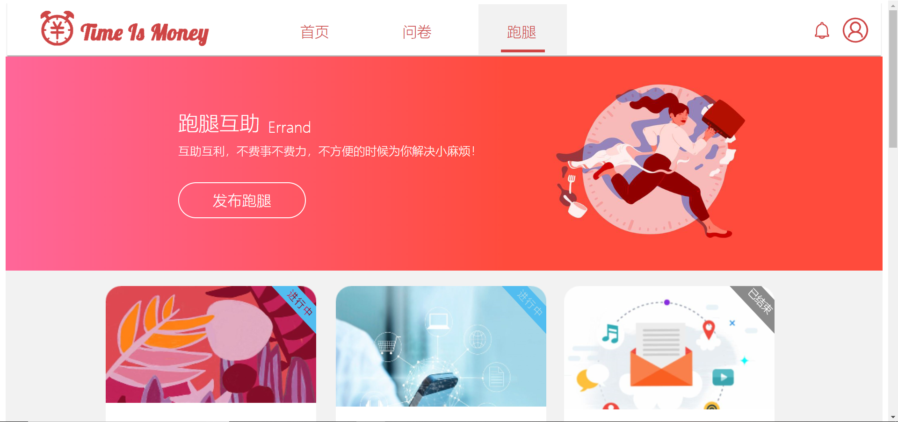
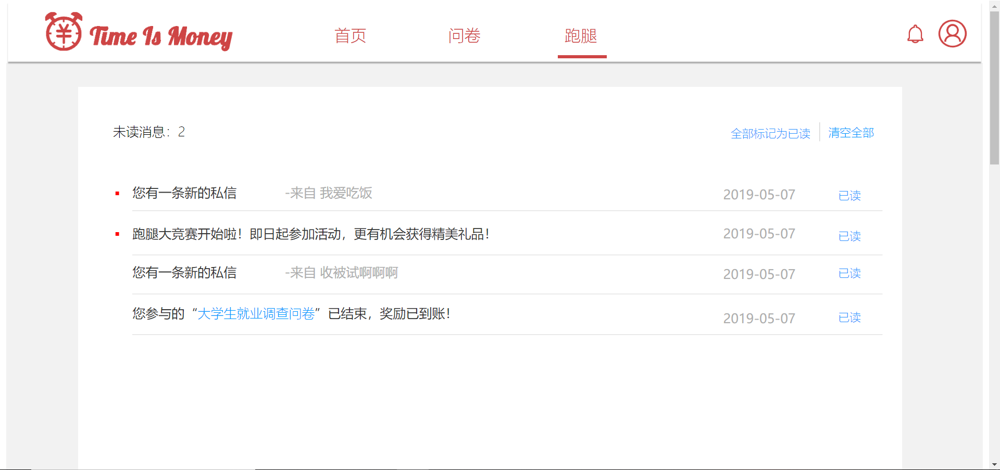
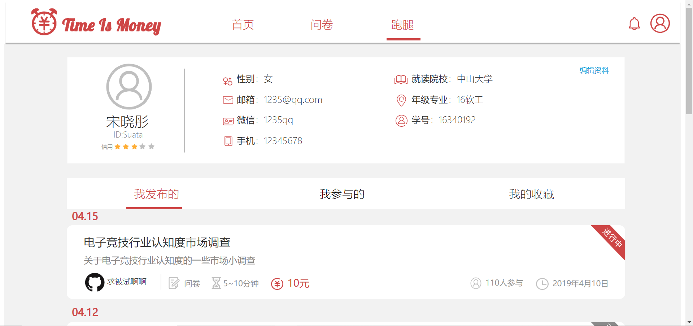

# Time is Money 项目概况

## 一、概述 Overview

Time is Money（T.I.M）是一款专为大学生设计的任务驱动的C2C在线应用，其中，作为任务的发布者与接收者，用户可以通过指定行为进行收益的赚取与社交的展开。

T.I.M主要支持用户任务的发布与接收行为，其中，任务类型主要分为问卷与跑腿。

**问卷**

针对用户信息征集的需求，发布者可以根据自身需要发布一定数量的有价值问卷，系统根据问卷发布时间进行填写者的征集。参与者完成问卷后即可获得对应收益

**跑腿**

针对用户对于代购、代签、代取等行为的需求，发布者根据实际情况发布跑腿任务，每个跑腿任务最多征集一名参与者，成功接单者完成后可获得相应收益

## 二、 特性 Personalization

除了基本的任务创建与接收，T.I.M的其他个性化设置如下：

- 关注用户对于任务属性的关心程度，首页设置推荐板块
- 为任务发布者提供完整的进度通知，任务管控一手掌握
- 设置严格的抵押制度，为用户收益提供保障
- 提供完善的数据统计，记录收益点滴
- 推送大型活动信息，使用户获得优质信息的附加收获

## 三、迭代 Iteration

### 大熊座迭代

迭代时间：week7 - week11

迭代内容：完成问卷功能基础上新增首页功能，完善着陆页功能。

迭代情况：已完成

### 天枢座迭代

迭代时间：week12 - week13

迭代内容：新增通知功能，完善问卷模块。

迭代情况：已完成

### 天璇座迭代

迭代时间：week14 - week15

迭代内容：新增跑腿模块，完成跑腿功能。

迭代情况：已完成

### 摇光座迭代

迭代时间：week16 - week17

迭代内容：完善跑腿功能，完善问卷部分内容，优化界面。

迭代情况：已完成

## 四、UI初步原型 Prototype

问卷页面设计

跑腿页面设计

通知页面设计

个人页面设计

详见[UI设计](https://github.com/system-design2019/files/blob/gh-pages/UI_design)
