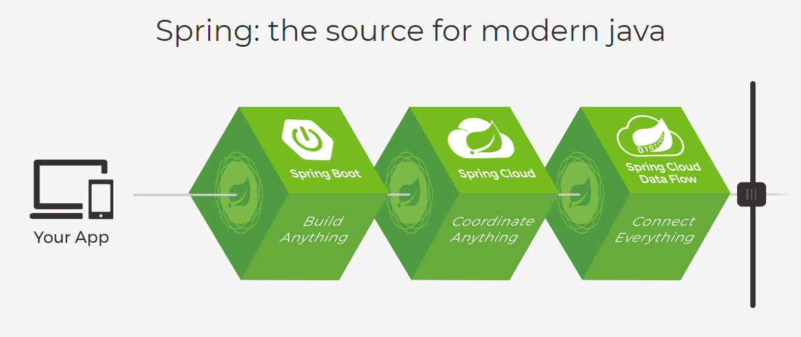
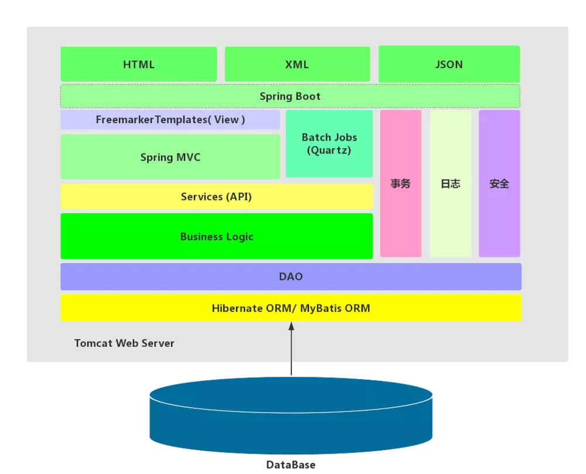
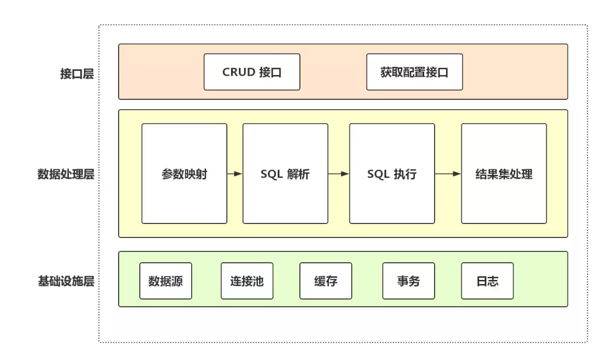
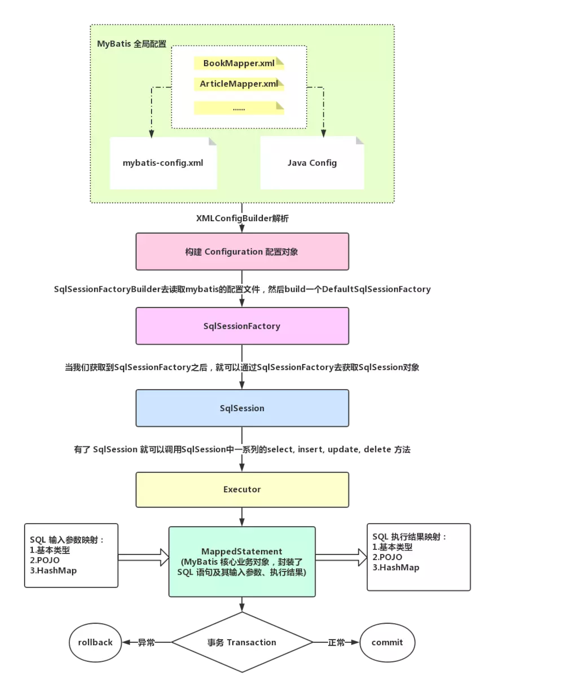
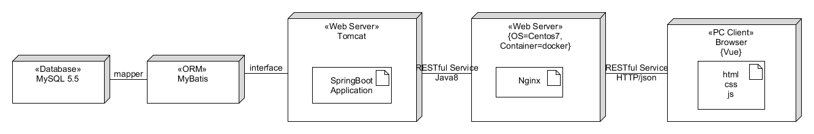
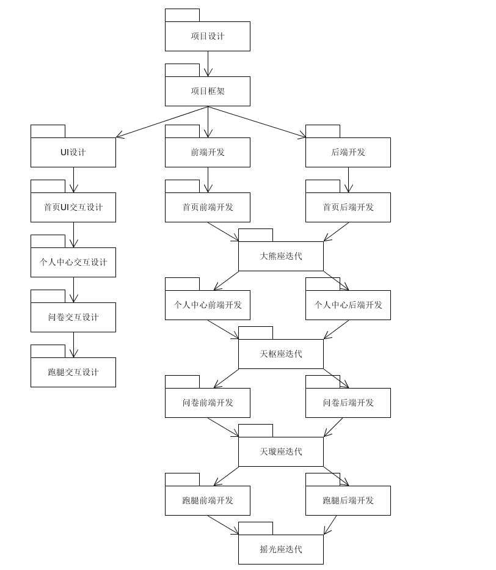

# 架构问题

## 技术选型

### 跨平台性

//前端来写

### 技术选型理由

**Spring Boot**!

- 什么是`SpringBoot`

  在使用传统的`Spring`去做Java EE（Java Enterprise Edition）开发中，大量的 XML 文件存在于项目之中，导致`JavaEE`项目变得慢慢笨重起来，，繁琐的配置和整合第三方框架的配置，导致了开发和部署效率的降低。

  Spring Boot 并不是用来替代 Spring 的解决方案，而是和 Spring 框架紧密结合用于提升 Spring 开发者体验的工具。同时它集成了大量常用的第三方库配置，Spring Boot应用中这些第三方库几乎可以是零配置的开箱即用（out-of-the-box），大部分的 Spring Boot 应用都只需要非常少量的配置代码（基于 Java 的配置），开发者能够更加专注于业务逻辑。

- 优点

  - 从官方来看

    

  - 从`Spring`的优点来看

    - **良好的基因**

      因为`SpringBoot`是伴随着Spring 4.0而生的，boot是引导的意思，也就是它的作用其实就是在于帮助开发者快速的搭建Spring框架，因此`SpringBoot`继承了Spring优秀的基因，在Spring中开发更为方便快捷

    - **简化编码**

      比如我们要创建一个 web 项目，使用 Spring 的朋友都知道，在使用 Spring 的时候，需要在 pom 文件中添加多个依赖，而 Spring Boot 则会帮助开发着快速启动一个 web 容器，在 Spring Boot 中，我们只需要在 `pom` 文件中添加如下一个 `starter-web` 依赖即可。

    - **简化配置**

      `Spring` 虽然使`Java EE`轻量级框架，但由于其繁琐的配置，一度被人认为是“配置地狱”。各种XML、Annotation配置会让人眼花缭乱，而且配置多的话，如果出错了也很难找出原因。Spring Boot更多的是采用 Java Config 的方式，对 Spring 进行配置。

    - **简化部署**
      
    
    在使用 Spring 时，项目部署时需要我们在服务器上部署 tomcat，然后把项目打成 war 包扔到 tomcat里，在使用 Spring Boot 后，我们不需要在服务器上去部署 tomcat，因为 Spring Boot 内嵌了 tomcat，我们只需要将项目打成 jar 包，使用 java -jar xxx.jar一键式启动项目。
    
    另外，也降低对运行环境的基本要求，环境变量中有JDK即可。
  
- **简化监控**
  
  我们可以引入 spring-boot-start-actuator 依赖，直接使用 REST 方式来获取进程的运行期性能参数，从而达到监控的目的，比较方便。但是 Spring Boot 只是个微框架，没有提供相应的服务发现与注册的配套功能，没有外围监控集成方案，没有外围安全管理方案，所以在微服务架构中，还需要 Spring Cloud 来配合一起使用。
  
- **从未来发展趋势看**
  
  微服务是未来发展的趋势，项目会从传统架构慢慢转向微服务架构，因为微服务可以使不同的团队专注于更小范围的工作职责、使用独立的技术、更安全更频繁地部署。而 继承了 Spring 的优良特性，与 Spring 一脉相承，而且 支持各种REST API 的实现方式。Spring Boot 也是官方大力推荐的技术，可以看出，Spring Boot 是未来发展的一个大趋势。

## 架构设计

### 前端架构设计

### 后端架构设计

- 技术栈

  **Java 1.8.0 + Spring Boot + MySQL5.5 + MyBatis**

- 开发环境

  **IntelliJ Idea + Java 1.8.0 + Spring Boot + MySQL5.5(服务器上)** 

- 部署环境

  **Java 1.8.0 + MySQL5.5+ Tomcat(9.0)(内嵌)**

#### Spring Boot架构



#### MyBatis架构



#### MyBatis运行流程



### 逻辑视图

### 物理视图



### 开发视图



### 处理视图

//后端画一下，不用太正规

## 模块划分

### 前端


### 后端

```
├─java
│  ├─META-INF	//java配置文件
│  │      MANIFEST.MF
│  │      
│  └─xyz
│      └─timoney
│          └─swsad	//运行入口
│              │  SwsadApplication.java
│              │  
│              ├─bean	//java类对象
│              │  │  Message.java	//同一返回消息格式
│              │  │  MoneyRecord.java	//交易记录
│              │  │  Util.java	//工具类
│              │  │  
│              │  ├─errands	//跑腿类对象
│              │  │      Errands.java	
│              │  │      Errands_temp.java
│              │  │      Participant.java
│              │  │      Participant_temp.java
│              │  │      
│              │  ├─questionnaire	//问卷类对象
│              │  │      Infos.java
│              │  │      Ques1.java
│              │  │      Ques2.java
│              │  │      Ques2_temp.java
│              │  │      QuesContent.java
│              │  │      QuesResult.java
│              │  │      QuesResult_temp.java
│              │  │      Questionnaire.java
│              │  │      Questionnaire_temp.java
│              │  │      User_temp.java
│              │  │      
│              │  ├─quesUser	//问卷与用户的关系对象
│              │  │      QuesCollectUser.java	//问卷和用户收藏的关系
│              │  │      QuesFillUser.java	//问卷和用户填写的关系
│              │  │      
│              │  └─user	//用户对象
│              │          Code.java		//验证码
│              │          Converter.java	
│              │          Notification.java	//通知对象
│              │          User.java	//用户
│              │          UserState.java	//用户状态，主要是cookie验证
│              │          
│              ├─config	//服务器配置
│              │      WebConfig.java
│              │      
│              ├─controller	//api路由
│              │      Controller.java
│              │      ErrandsController.java
│              │      MoneyController.java
│              │      NotificationController.java
│              │      QuestionnaireController.java
│              │      UserController.java
│              │      VerifyCodeController.java
│              │      
│              ├─Exception	//自定义异常
│              │      GlobalExceptionHandler.java
│              │      MyException.java
│              │      
│              ├─intercepter	//自定义拦截器
│              │      CookieIntercepter.java
│              │      
│              ├─mapper	//mytatis的interface
│              │      ErrandsMapper.java
│              │      MoneyMapper.java
│              │      NotificationMapper.java
│              │      QuesCollectUserMapper.java
│              │      QuesFillUserMapper.java
│              │      QuestionnaireMapper.java
│              │      UserMapper.java
│              │      
│              ├─service	//一些比较有用的工具服务
│              │      Email.java		//发邮件的功能实现
│              │      JwtHelper.java	//session控制
│              │      SMS.java		//发短信功能实现
│              │      
│              └─singleton	//mybatis的单例类
│                      SingletonMybatis.java
│                      
└─resources	//资源文件
    │  application.properties
    │  spring-mybatis.xml
    │  
    ├─mappers	//mybatis的sql实现
    │      errandsMapper.xml
    │      moneyMapper.xml
    │      notificationMapper.xml
    │      quesCollectUserMapper.xml
    │      quesFillUserMapper.xml
    │      questionnaireMapper.xml
    │      userMapper.xml
    │      
    ├─privateKey	//阿里云短信推送和邮件推送的私钥，不放在git里
    │      EmailKey.txt
    │      SMSKey.txt
    │      
    └─static	//邮件推送的模板
            mail_forget_password_template.html	//忘记密码邮件模板
            mail_recharge_confirm.html	//充值通知管理员邮件模板
            mail_register_template.html	//注册邮件模板
            mail_withdraw_confirm.html	//提现通知管理员邮件模板
```
