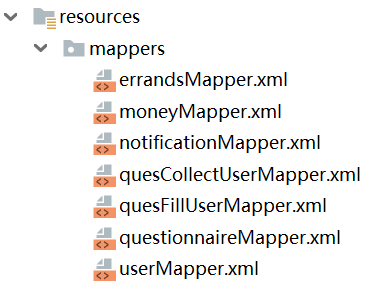
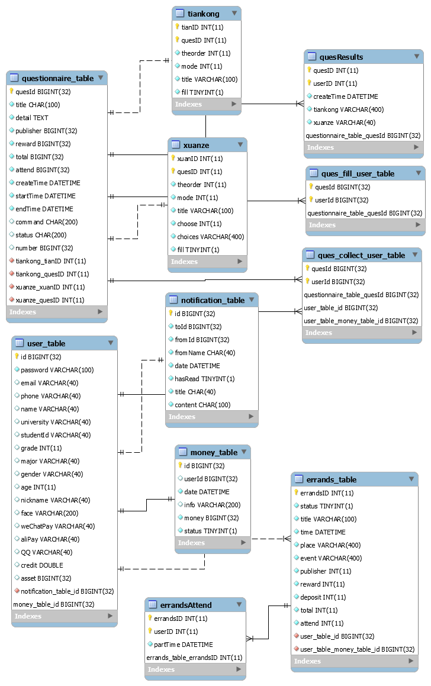

#### 三层架构

通常意义上的三层架构就是将整个业务应用划分为：界面层（User Interface layer）、业务逻辑层（Business Logic Layer）、数据访问层（Data access layer）。

区分层次的目的即为了“高内聚低耦合”的思想。在软件体系架构设计中，分层式结构是最常见，也是最重要的一种结构。微软推荐的分层式结构一般分为三层，从下至上分别为：数据访问层、业务逻辑层（又或称为领域层）、表示层。

##### 界面层

要功能是显示数据和接受传输用户的数据，可以在为网站的系统运行提供交互式操作界面，表示层的应用方式比较常见，例如Windows窗体和Web页面。

界面汇总

###### 首页
跳转页面

- 界面元素：进入首页按钮、登录按钮、基本信息

首页显示页面

- 界面元素：登录按钮、注册按钮、首页信息（游客登录）

登录页面

- 界面元素：登录按钮、账号密码输入处、找回密码按钮、立即注册按钮

注册页面

- 界面元素：信息填入处、立即注册按钮、“已有账号，请登录”按钮

找回密码页面

###### 问卷功能页面

问卷展示页面

- 界面元素：问卷展示区域、发布问卷按钮、排序工具、分页工具

问卷设计页面

问卷详情界面

- 界面元素：详情信息、收藏/取消收藏按钮、填写按钮、删除按钮、回退按钮

问卷信息编辑页面

问卷填写界面

- 界面元素：题目信息，返回按钮，提交按钮

###### 跑腿功能页面

任务表页面（发单）

- 界面元素：任务描述、发布者信息

押金提交页面

- 界面元素：二维码

已发布任务界面

- 界面元素：已发布任务列表、任务状态、放弃任务按钮、评分按钮

已接受任务界面

- 界面元素：已接受任务列表、任务状态、放弃任务按钮

任务栏界面（接单）

- 界面元素：待接受任务列表、接受任务按钮

任务详情界面

- 任务描述、发单人信息

评分页面

- 评分标准

###### 个人页面

个人信息页面

- 个人基本信息，以及头像、昵称、用户ID、信用评分、历史成交数等

用户头像详情页面

- 用户头像图片选择，上传按钮

用户昵称更改页面

- 新昵称填写，确定按钮

用户成交历史详情页面

- 用户成交历史显示，删除按钮

###### 收件箱页面

登录后显示页面

- 主页信息、收件箱按钮

收件箱页面

- 收到的消息


##### 业务逻辑层

将用户的输入信息进行甄别处理，分别保存。建立新的数据存储方式，在存储过程中对数据进行读取，将“商业逻辑”描述代码进行包含。

主要是针对具体的问题的操作，也可以理解成对数据层的操作，对数据业务逻辑处理，如果说数据层是积木，那逻辑层就是对这些积木的搭建。

controller将对数据进行逻辑处理


例如，

一个controller中的函数，获取全部参与跑腿

其中包含了对参与跑腿的筛选的逻辑和具体操作

```java
/**
     * 获得全部参与跑腿
     * */
    @RequestMapping(method = RequestMethod.GET,value = "/allErrand/{userID}")
    @CrossOrigin
    public Message<List<Integer>> errandsByUserID(@PathVariable int userID){
        Message<List<Integer>> message = new Message<>();
        List<Integer> parts=new ArrayList<>();
        //获取一个连接
        try (SqlSession sqlSession = sqlSessionFactory.openSession()) {
            //得到映射器
            ErrandsMapper erraMapper = sqlSession.getMapper(ErrandsMapper.class);

            //调用接口中的方法去执行xml文件中的SQL语句
            List<Integer> errands = erraMapper.allPartErra(userID);


            message.setData(errands);
            message.setSuccess(true);
            message.setMsg("获取成功");
            //要提交后才会生效
            sqlSession.commit();
        } catch (Exception e) {
            message.setData(null);
            message.setSuccess(false);
            message.setMsg("获取失败:" + e.getMessage());
        }
        //最后记得关闭连接
        System.out.println(message);
        return message;
    }
```


##### 数据访问层

数据访问层在作业过程中访问数据系统中的文件，实现对数据库中数据的读取保存操作。

主要是对非原始数据（数据库或者文本文件等存放数据的形式）的操作层，而不是指原始数据，也就是说，是对数据库的操作，而不是数据，具体为业务逻辑层或表示层提供数据服务。

使用xml映射操作数据库



以errandsMapper中的一个操作为例，对数据库进行插入操作

```mysql
<!--发布一个跑腿-->
    <insert id="insert" parameterType="Errands">
        insert into errands_table (errandsID, status,title, time,place,event, publisher, reward,deposit, total, attend)
        values (${errandsID},${status},"${title}", "${time}","${place}","${event}",${publisher}, ${reward}, ${deposit}, ${total}, ${attend})
    </insert>
```


