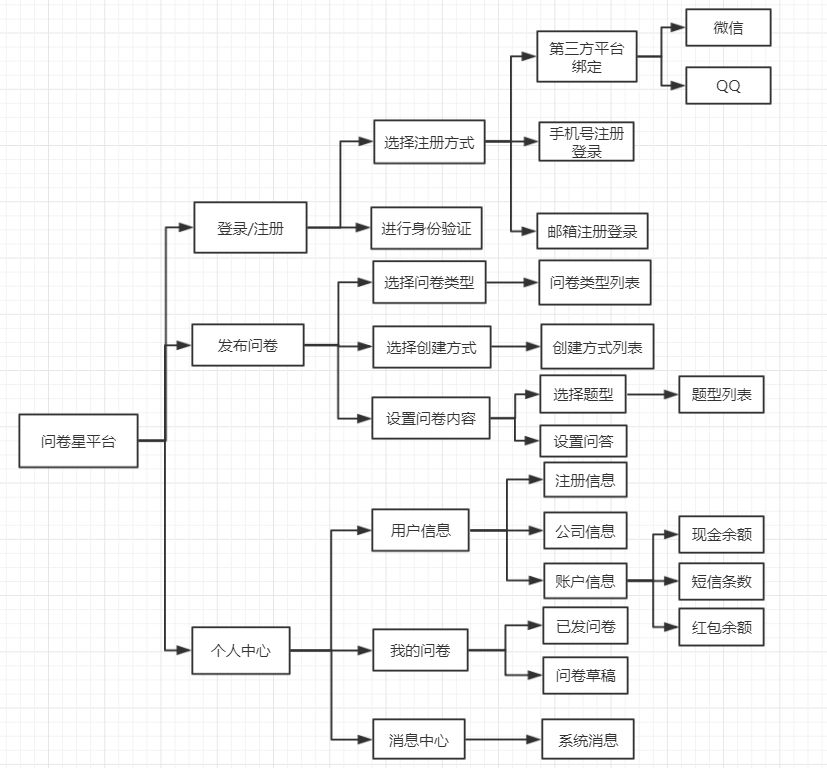
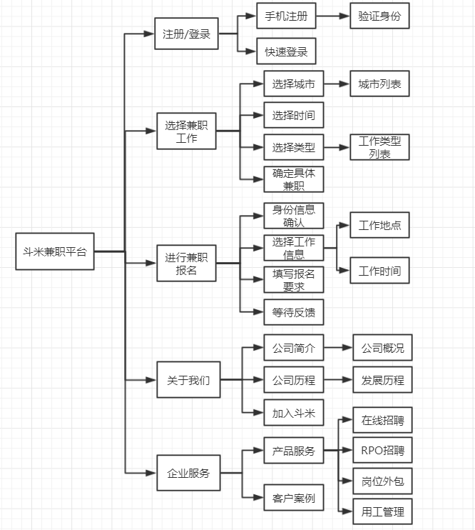

# Time is Money项目前期调研
## 一、背景
Time Is Money是一款校园内的面对高校学生的兼职平台，由于内部是学生自发自接的兼职形式，所以在当前市场中没有完全相同的产品。我们在问卷功能方面针对问卷星进行了调研，在跑腿功能针对斗米兼职进行了调研，对他们是相关软件应用进行竞品分析，力求探索一种适用于校园兼职的服务程序，确定必须服务和优化用户体验的服务。

## 二、交互设计与技术分析
### 问卷模块
针对项目中问卷模块的业务，我们选择了问卷星这款竞品做了详细的交互过程与功能架构设计做了分析。

#### 功能框架

**问卷星分析：**

1、问卷种类很多，创建方式丰富。

2、可设置问题类型有多种，可以极大程度满足一般用户的需求。

3、创建问卷的整体过程略有繁琐，需要多次选择各种类型。

4、功能相对单一，只提供制作问卷并生成链接的功能。

### 跑腿模块
针对项目中跑腿模块的业务，我们选择了斗米兼职这款竞品做了详细的交互过程与功能架构设计做了分析。
#### 功能框架

**斗米分析：**

1、斗米兼职平台是一个全开放式的平台，不限制任何客户，受众面广。

2、斗米平台上工作种类多，可以为每个客户提供合适的兼职工作。

3、斗米的可靠性较低，对于客户和商家都没有有力的限制，容易造成安全缺失的环境问题。

4、斗米在整个产品的分布中有很大一部分都是团队和公司的介绍，显得重点不够突出。

## 三、交互体验
#### 问卷星
- 整体板块简洁明了，给客户一种舒服简约的感觉。
- 在创建问卷时，繁琐的程序容易令人感觉复杂麻烦。
- 提供的功能丰富，种类较多，给客户良好的使用体验。

#### 斗米兼职
- 网页布局过于密集，无法突出核心重点功能。
- 检索过程比较明了，可以较快筛选想要的兼职。
- 除了几个网页较为常用，剩下的多数网页类似于团队介绍等过多，形成了浪费，也造成功能特色不突出。

## 四、亮点借鉴
#### 问卷星
- 个人问卷中心的统计，可以看到自己发出或填写了多少问卷。
- 添加问卷跟踪功能，为每一个问卷提供当前状态、填写人数等实时信息。
- 提供常用的问卷题型，不提供画图、情景随机等较少使用题型。

#### 斗米兼职
- 只提供任务的发布信息和审核，不参与具体任务的干涉。
- 突出功能的重点，给客户良好的使用体验。
- 提高平台对客户的安全性和可靠性承若。

## 五、总结
综合前面调研的各个产品的优势和特点，我们需要完成的产品需要更为细致的考虑到用户的需要。在这两款竞品中我们都看到了一些优势和不足之处，比如问卷星致力于提供优质的问卷，有非常丰富的问卷题型和问卷种类，这无疑是专业性的表现。但同时，复杂的流程也会给客户带去繁琐的用户体验。而在斗米兼职中，有多种多样的兼职工作供客户选择，我们确实可以找到合适、满意的工作。但是没有违约的限制，提高可靠性的措施无疑会令客户产生一些不信任的情绪。所以我们在后来的开发中应当借鉴竞品的优良之处，避免出现竞品中已经存在的问题。

Time Is Money是一款全新的产品，一款只面向高校学生的兼职平台。在目前市场中没有类似的产品出现，这无疑是我们这款商品的优势所在，但同时也意味着将会有很多竞品相继出现，我们即将面临市场上的巨大竞争压力。在未来的开发中我们应尽量优化产品，避免缺点的产生，优秀的产品才能保证市场中的竞争力。
