##  System Sequence Diagrams

### 问卷

#### 用户发布问卷

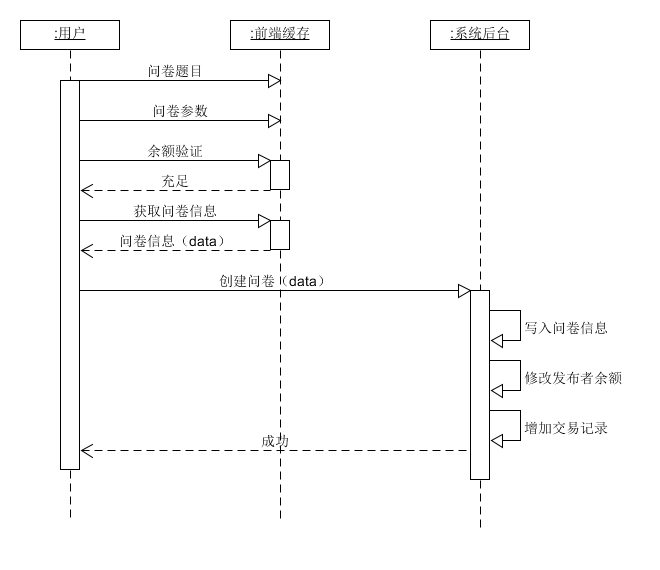

#### 用户填写问卷

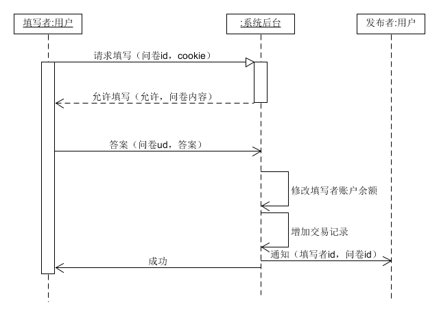

#### 用户关闭问卷

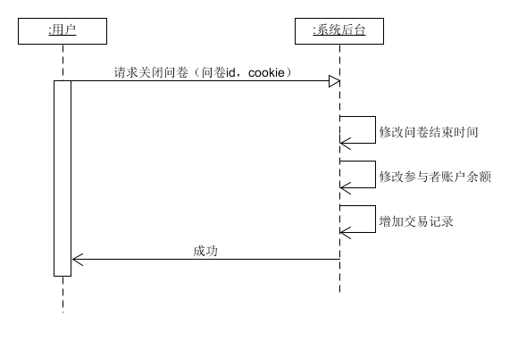

#### 用户删除问卷

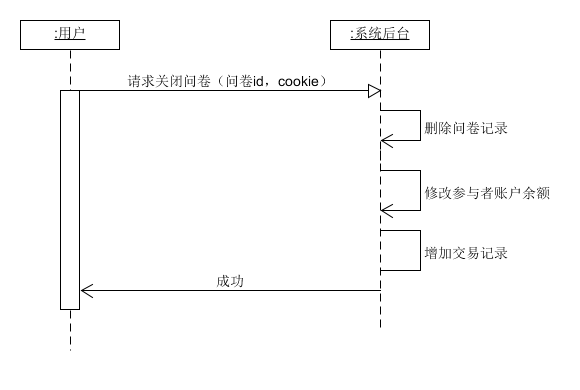

### 跑腿

#### 用户发布跑腿

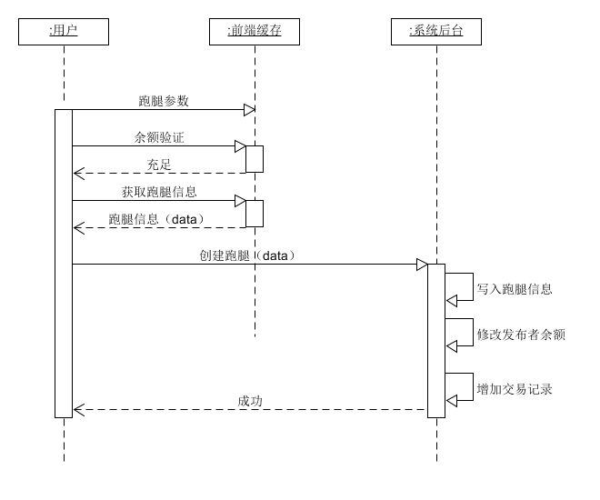

#### 用户参与跑腿

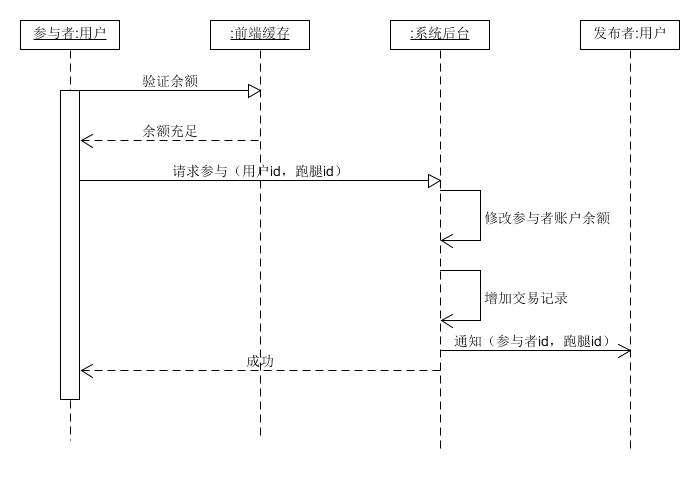

#### 用户关闭跑腿

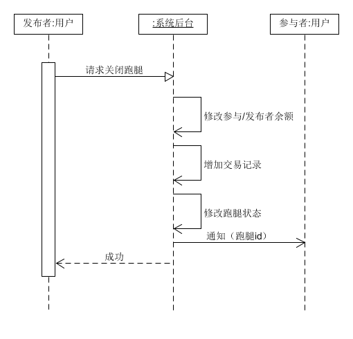

#### 用户删除跑腿

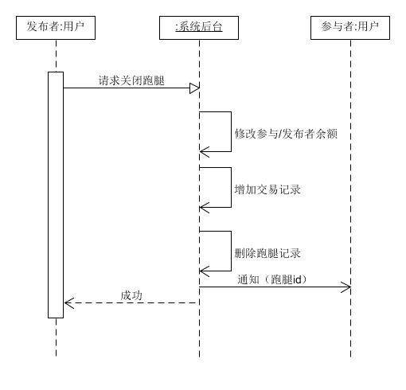

### 账户管理

#### 充值

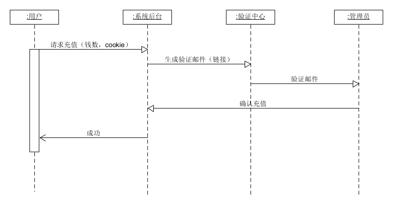

#### 提现

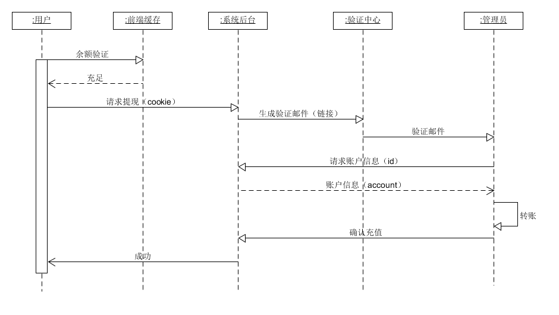

### 通知管理

#### 接收通知

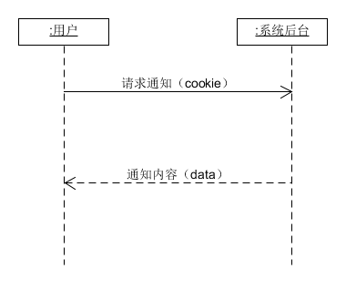

#### 删除通知

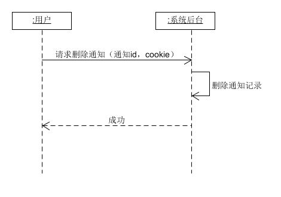

#### 发送通知

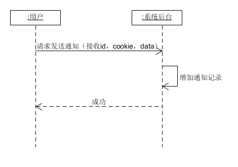

#### 标为已读/未读

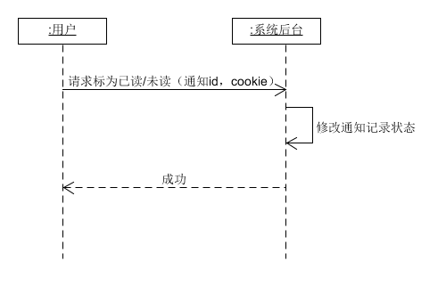

### 个人中心

#### 用户登录

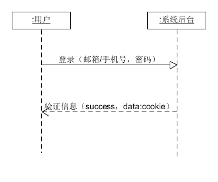

#### 用户注册

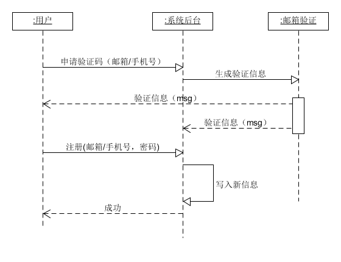

#### 修改信息

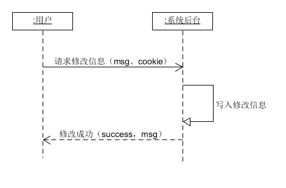