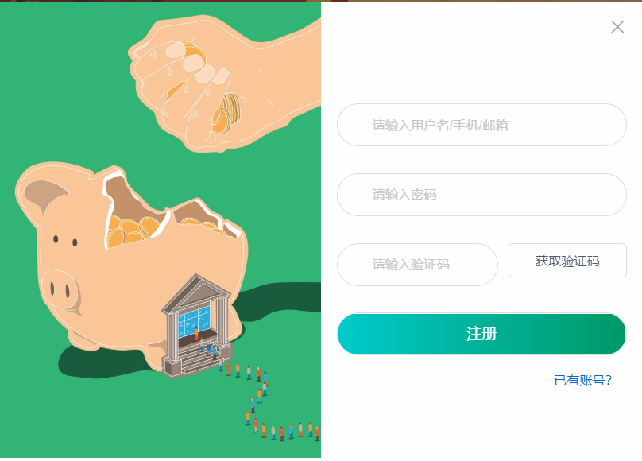
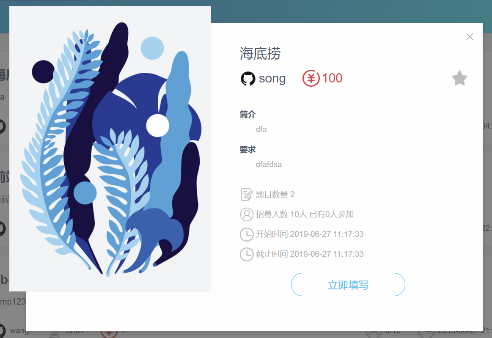
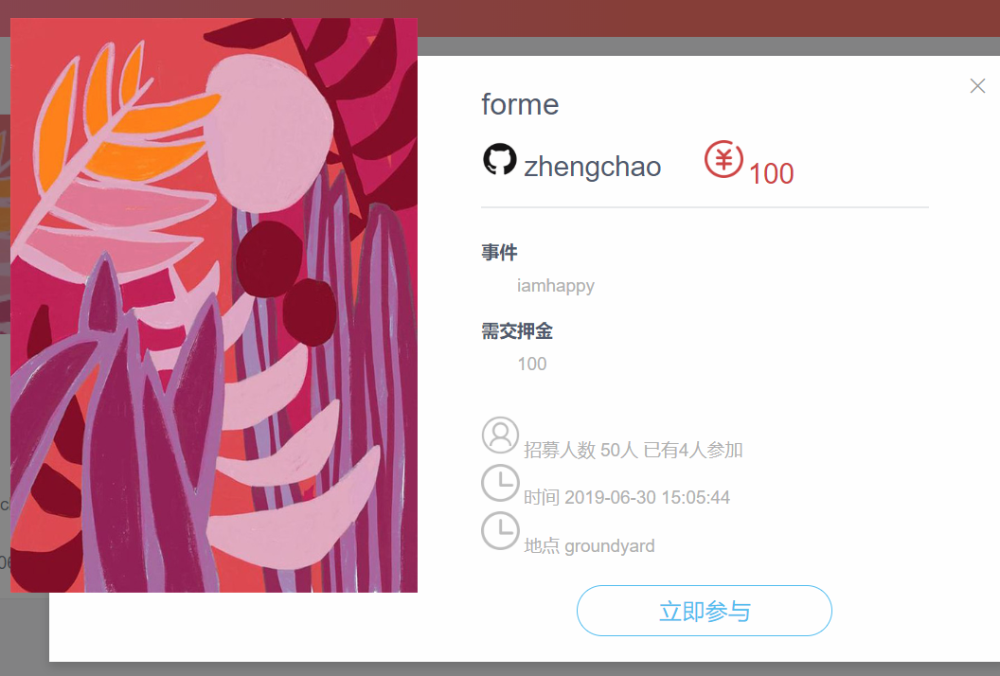
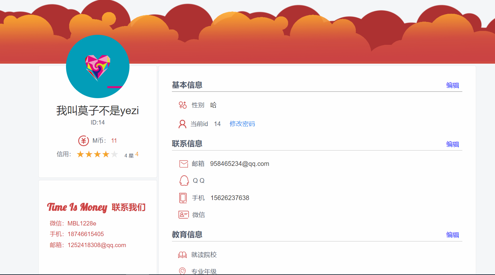

# UI设计文档

## 1 颜色设置

**主题色**：#ce4545，用于着陆页、导航栏、强调字体色、icon等

从系统“挣闲钱”的主题出发，考虑到与交易相关的内容选择暖色较为恰当，能够体现出热情、向上、积极的氛围，刺激人的视觉，促进消费交易；红色又为多个交易类app的主题色，如天猫、京东、小红书等，主题色都为红色。

此外，过于鲜艳的红色一方面过于刺眼，不适于大范围使用；另一方面也容易塑造出一个轻浮的应用形象。最终选用颜色较深的红色。

**辅助色**：

#52bdf0，用于问卷界面，问卷类内容选取相对理性的蓝色，且问卷星等相似功能主题色也为蓝色；

#00cccc，用于注册界面，与登录界面的#ce4545的红色形成对比；

#fc4a1a，用于充值页面，同样使用暖色，偏黄的橙色更符合金币（M币）的形象。

## 2 logo设计

使用主题色#ce4545，结合产品名“Time Is Money”，将代表时间的钟与代表金钱的￥结合在一起，￥即为钟表的表针，意为时间即是金钱，即Time Is Money。

## 3 元素设计

### 3.1 登录界面

 使用主题色进行设计，左部图片符合主题色为红色，右半部分的头像和按钮使用了渐变色，比较有透明感。按钮与输入框均使用了宽度基本相等的圆角矩形，比较美观。右下角包括找回密码和立即注册两个按钮。

### 3.2 注册界面

注册界面与登录界面样式呼应，使用了绿色主题色，按钮与输入框同样是圆角矩形渐变色的设计。

### 3.3 首页

**3.3.1 首页顶部广告位**

 该部分为一个滚动的广告位，一般可用于放置网站内部活动或其他广告等。如图所示即为该广告位的一张宣传图片。

**3.3.2 首页底部**

首页下半部分主要是对一些问卷的推广；左侧的列表是对薪酬较多问卷的推广，右边的块状结构则是对不同类型问卷的推送。色彩方面上使用了较为明快的颜色搭配，能够凸显首页的活跃。

### 3.4 问卷页面

- 页面头部使用宽度为100%的页面，以凸显发布问卷按钮。主题色为蓝色，比较符合问卷的主题。这里同样使用了较为清爽透明的渐变色，按钮同样使用了圆角矩形样式，与其他位置样式基本一致。

- 页面下半部分是问卷列表，问卷元素的设计同样使用了圆角矩形的card样式，并根据相关信息配上不同的icon。其中表示薪酬的字体较大，也用主题色加以强调。右上角的标签分为进行中、我的、已参与三种，颜色不同，用来表示问卷的不同状态。

### 3.5 问卷详情

采用了浮动图片的弹出框效果，主题色同样是蓝色；右上角的星星是收藏按钮，立即填写按钮与顶端按钮相同。

### 3.6 跑腿界面

- 顶部使用了主题色红色，反映了跑腿的活力状态。渐变色、圆角按钮与字体设计均与问卷界面相似，并与其相反，图片切合主题。
- 底部为跑腿列表界面，设计成了与问卷界面不同的方格式列表，且头部的图片可以根据需求进行更换。

### 3.7 跑腿详情

与问卷详情框对比，换用了红色的主题色，其他形式基本相同。

### 3.8 我的M币界面

使用了橙色主题色，对金币的主题进行了呼应。下方的交易记录icon设计了三种，分别是提现、转账与其他，使用了红色、蓝色、紫色的不同icon。

### 3.9 个人资料页

顶部空出位置放置了一张红色主题色的装饰图，原型头像框使用了浮动样式，并将重要信息与其他信息拆为不同card。头像card下的位置放置了联系我们card。

## 4 素材使用

​	设计中使用的部分素材来自pinterest、花瓣网及iconfont等素材网站，目前仅做项目使用，并未商用，若有侵权则会立即删除，除此之外的素材均为原创设计。