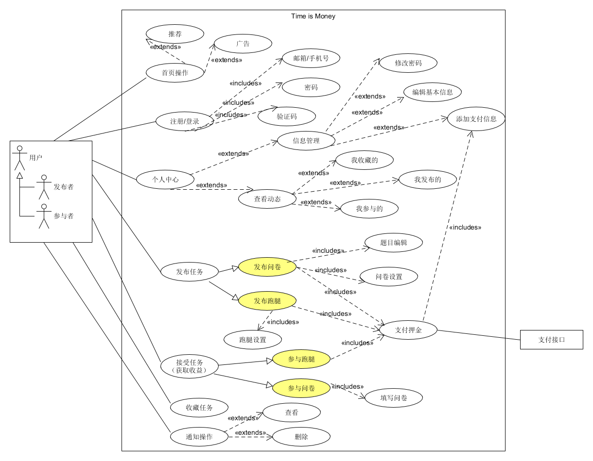
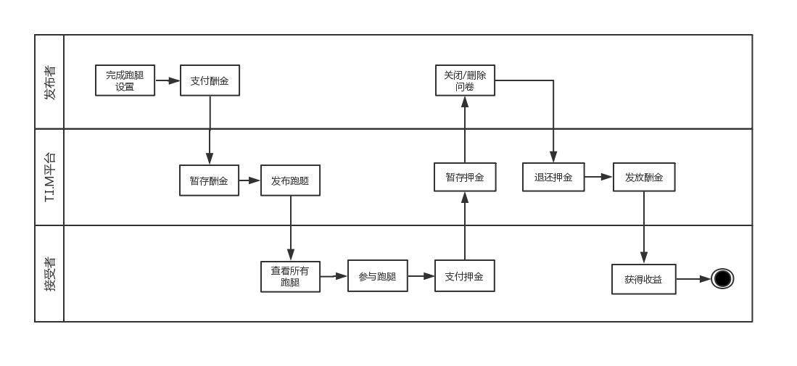

## Usecase Diagram

下图为Time is Money挣闲钱平台系统用例图一览，其中，子用例图及其活动图见[6.2 Use Cases](https://system-design2019.github.io/files/Usecase)

Time is money的用例主要包括注册/登录、首页操作、发布任务、接受任务、收藏任务，以及通知操作，其中不同的用例所关联的用例也不相同，下图对此做出了总体的说明。

## UML Activity Diagram

对于Time is Money平台来说，最主要的业务逻辑在于任务的交易过程，任务又被分为跑腿与问卷，由此，我们分别对这两项业务进行泳道图绘制(以下业务流程均为happy path)

（1） 问卷交易业务：发布者编辑问卷题目->发布者设置问卷信息->发布者提交押金->接受者接受任务->接受者填写问卷->发布者关闭问卷->交易结算

（2）跑腿交易业务：发布者设置跑腿信息->发布者提交押金->接受者提交押金->接受者完成任务->发布者确认跑腿完成->交易结算

