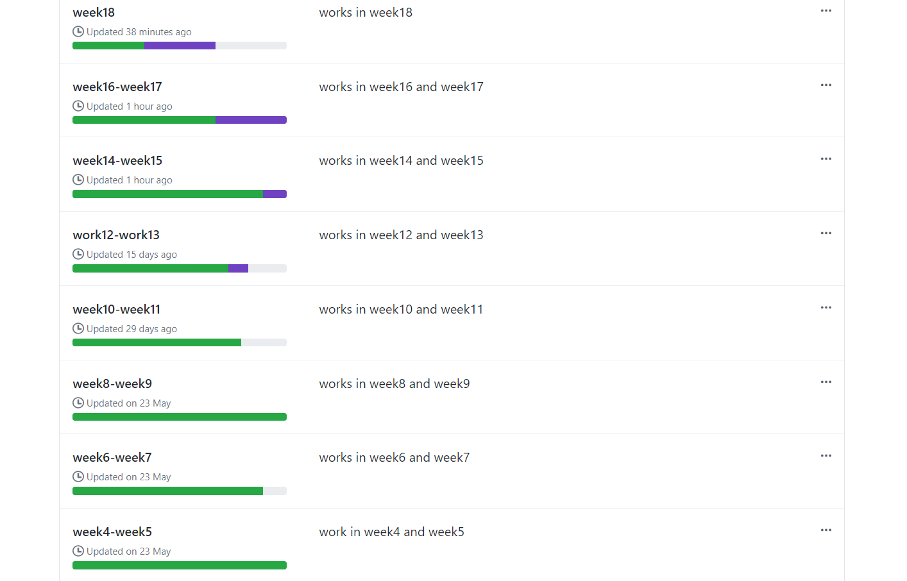
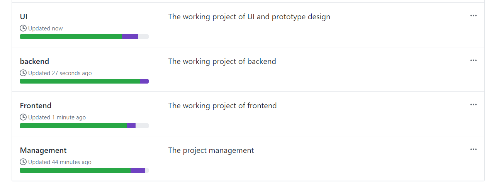
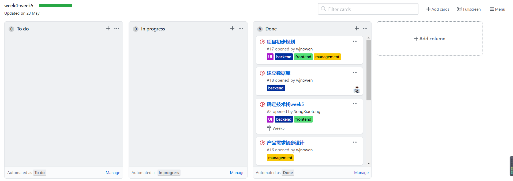
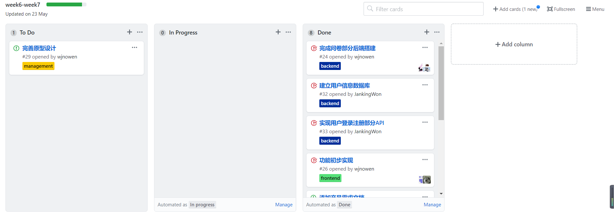
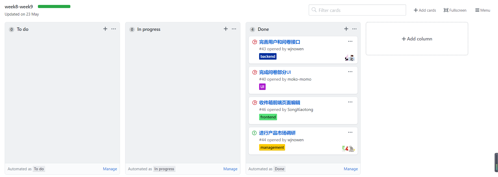
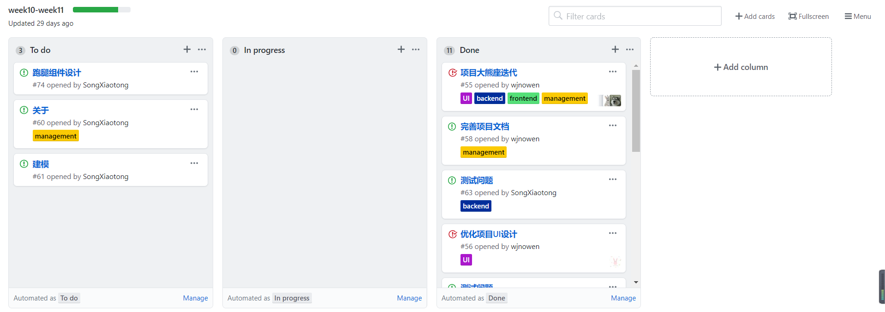
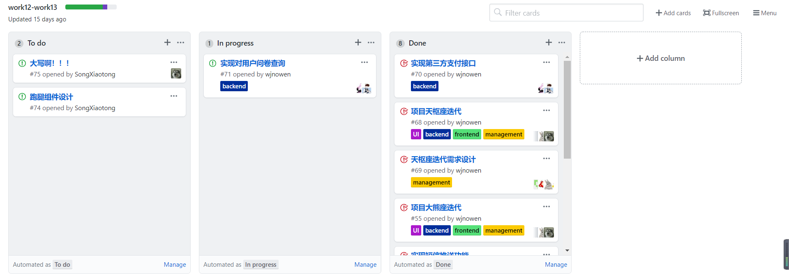
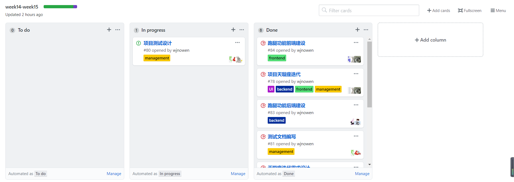
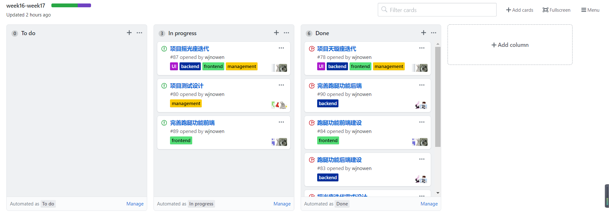
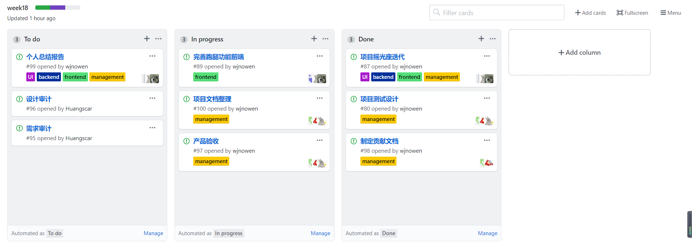

# kanban汇总

### 看板总览

这是我们小组的看板总览，整个项目从week4开始，持续至week18项目结束。

以上是我们项目的分组，包括管理、前端、后端和UI，以及各个分组的看板情况。

### 看板详情

#### week4 - week5

此时在项目准备阶段，任务分配较少。

#### week6 - week7

此时在项目前期调研阶段，任务也比较少。

#### week8 - week9

项目起步阶段，开始进行简单的设计和基础功能的实现。

#### week10 - week11

项目进入正式开发周期，并进行第一次（大熊座）迭代。

#### week12 - week13

项目第二次（天枢座）迭代。

#### week14 - week15

项目第三次（天璇座）迭代。

#### week16 - week17

项目第四次（摇光座）迭代，项目进入收尾阶段。

#### week18

项目验收阶段，进行总结工作。

