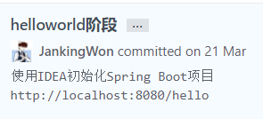
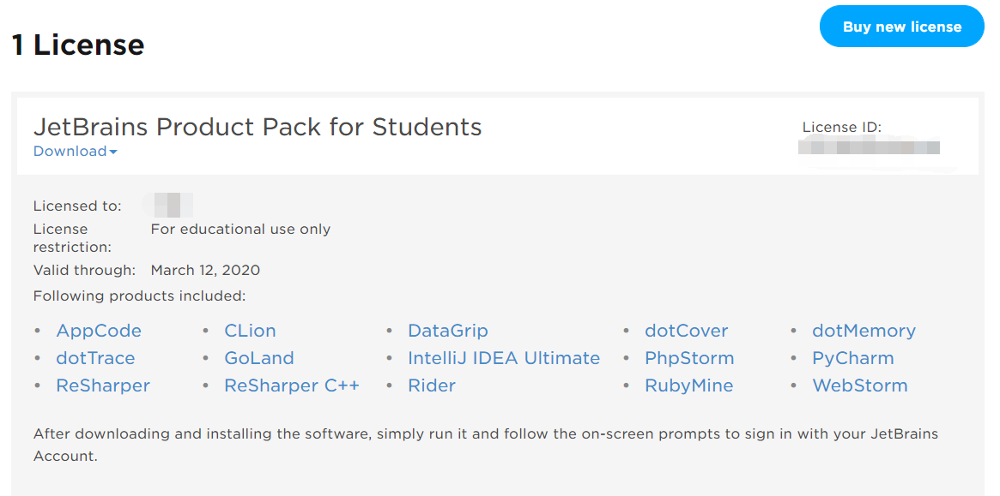
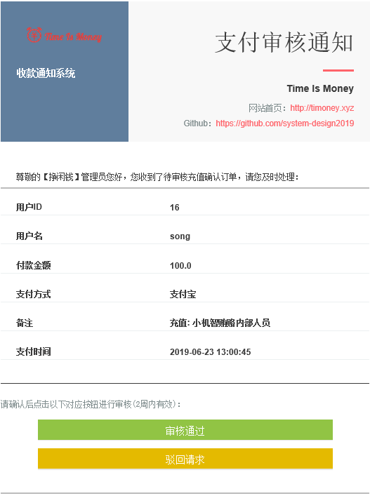
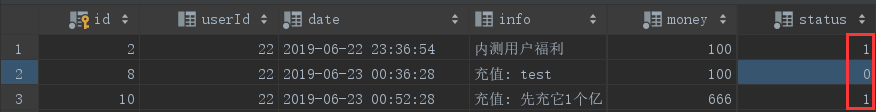
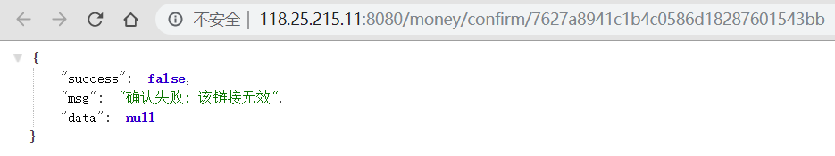
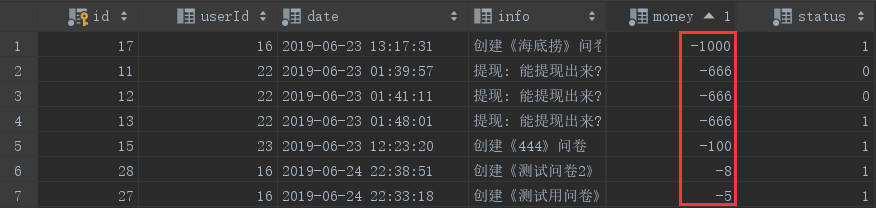
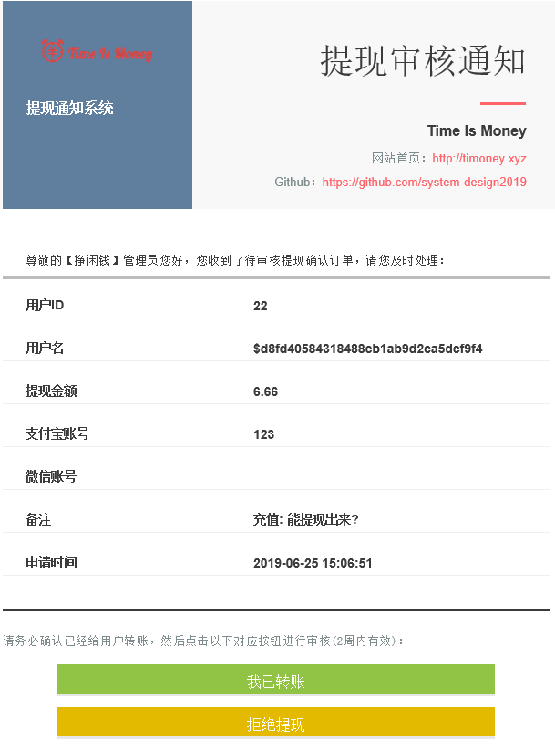
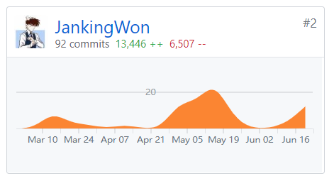
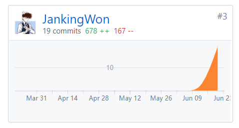
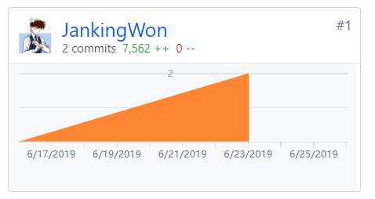

##  个人简短小结

本来没想学后端，但是秉持着对Java的热爱，用着流行了数十年的技术开始琢磨我们的项目

（我说是世界上最好的语言没意见吧:dog:/狗头​）

> 其实我们这个项目还是挺庞大的（设想很庞大，事实不堪)，而且根据随便一篇CSDN博客旁边的广告都有Java的文章来看Java开发遇到的坑还是蛮多的，如果贸然用Go或者Node.js可能语法都要学好久，加上在大三这个本应该找实习的年纪有了整个大学学期最多的课的时代背景下，实在不现实。更何况，要是用Java写个像样的后端，给凉凉的秋招也增添了一丝暖意，作为一个奋不顾身想投入996企业怀抱的当代青年，Python，Node等小站技术在互联网上占据的席位可谓少之又少，牛客网上的人才们也都是一边敲着`System.out.println`，一边说着好听的话......

> （以上并非本人真实想法）
>

那是2019年3月21日的一个晚上，我抑制不住了自己的欲望，在互联网上开始寻求有用的资源，我打开了一个个网页，走马观花一遍并没有觉得刺激到我，一连看了几十个大小网站，始终没有找到那种让我欲罢不能的感觉，终于，在某个大型~~广告~~网站上找到了一个看了之后自己的手就停不下来的资源，果然还是某些打开就是形形色色广告的网站靠谱。

我模仿着这个网页上的操作，用我勤劳的双手反复敲打着我最心爱的物体，时不时还会发出由内而外舒服的感叹，看了一遍之后，我甚至又反复看了好几遍，因为它的细节描写真的很到位！当我最终完成这件事情时，我立刻合上了笔记本的盖子，累的只想爬上床睡觉，而且竟让当我躺在床上的时候，脑海中依然是刚刚的画面，迟迟不能入睡...

现在我就把这个资源分享给大家

[idea+spring boot+mybatis+restful风格的demo](https://blog.csdn.net/qq_18297675/article/details/79407438)

这篇博客介绍了从零开始搭建一个RESTful风格服务端的程序，用了近年流行的`SpringBoot`，以及对编码友好的数据库访问神器`MyBatis`，我根据这篇教程，上来反手就是一个用户数据增删改查还有登录与注册，丝毫不拖泥带水（~~那我后面三个月干了啥？~~）

另外关于神器`IntelliJ IDEA`也是这次项目中我收获的一个重点

它有

- 非常好看的UI界面（我甚至觉得这就是最重要的）

- 非常友好的代码提示
- 非常方便的源码追溯
- 非常非常方便的插件管理
  - 这个插件管理就厉害了，装个`npm`插件直接运行前端代码
  - 装个`Go`插件，分分钟学习分析某站泄漏的源码
- 非常非常方便的Git集成
- 非常非常非常方便数据库图形查看和命令行执行

对了，标准版的好像不能用`JavaWeb`功能，这就是它更好的地方了，学生可以免费使用`JetBrain`全套专业软件！

链接如下

<https://www.jetbrains.com/student/>

嗯咳，好像偏题了

> 老师重要思想：“介绍你做了什么，而不是夸夸奇谈学到什么。”

这个项目的收获无疑是巨大的，学了几年的基础知识（~~也没怎么学好~~），现在基本上在这个项目都能得以体现，**做的工作**包括但不限于

- 使用面向对象的编程思想与RESTful的资源相结合，写出了更加逻辑清晰的代码
- 使用基本的数据结构算法知识，选出效率最高最好用的数据结构、轻松地完成一些排序、替换、查找的功能
- 利用数据库的基础知识，写了简单的SQL语句、熟悉常用的数据结构、做了简单的错误恢复日志查看
- 利用计算机网络的知识处理了域名与IP绑定的问题，跟前端一起解决跨域问题，以及一些基本的服务器网络操作如配置安全组、开发端口防火墙等问题
- 根据操作系统的知识远程连接Linux服务器，配置运行环境，部署源码并实时监控
- **利用系统分析与设计的开发方法，团队有分工地进行开发，每两周都会开会进行成果分享与指定下一阶段的目标，有成员坚持维护看板以及其它有关项目进度的资料，遇到问题在群里积极讨论，不因小项目妥协、基本的安全控制、访问控制、`ip`防护、缓存加速等等都有涉及到**

## Personal Software Process 2.1 统计

|                                       | Personal Software Process Stages         | Time (%) |
| ------------------------------------- | ---------------------------------------- | -------- |
| **Planning**                          | **计划**                                 | **10**   |
| estimate                              | 预估任务时间                             | 10       |
| **Development**                       | **开发**                                 | **80**   |
| analysis                              | 需求分析                                 | 5        |
| design spec                           | 生成设计文档                             | 5        |
| estimate                              | 设计复审（与前端团队成员审核设计文档）   | 5        |
| coding standard                       | 代码规范                                 | 5        |
| design                                | 具体设计，包括绘制 UI，设计架构等        | 5        |
| coding                                | 具体编码                                 | 30       |
| code review                           | 代码复审                                 | 5        |
| test                                  | 测试（修改代码）                         | 20       |
| **Report**                            | **报告**                                 | **10**   |
| test report                           | 测试报告                                 | 3        |
| size measurement                      | 计算工作量                               | 2        |
| postmortem & process improvement plan | 每次迭代结束后写总结文档，并提出改进计划 | 5        |

## 主要工作清单

- 确定后端框架
- 实现**用户**的如下功能（API）
  - 获取所有用户列表（调试用）
  - 登录
  - 注册
  - 修改资料（包括密码）
  - 删除账号
  - 上传头像
  - 获得用户发布的问卷列表
  - 获得用户收藏的问卷列表
  - 获得用户填写的问卷列表
  - 获得用户的交易记录
- 实现**问卷**的如下功能（API）
  - 获取某个用户发布的所有问卷（id、类对象）
  - 获取某个用户收藏的所有问卷（id、类对象）
  - 获取某个用户填写的所有问卷（id、类对象）
  - 收藏某个问卷
  - 取消收藏某个问卷
  - 填写某个问卷
  - 取消填写某个问卷
- 实现**验证**的如下功能（API）
  - 短信发送验证码
  - 邮件发送验证码
  - 对比验证码是否正确
- 实现**交易**的如下功能（部分是API）
  - 充值功能
  - 提现功能
  - 交易自动处理
  - 交易记录查询

还有下面的 **↓**

## 记录最得意/或有价值/或有苦劳的工作清单

- 使用`Cookie`**记录用户登录信息**，避免某些需要登录权限的页面被泄漏，比如`/questionnaire/{id}/fill`开始填写问卷，但是如果用户没有登录直接调用这个`API`会怎么样？

- 使用**内存和数据库两级缓存**，比如获取一个用户的个人信息会有很多的字段，每次页面刷新或者跳转这个`api`几乎都会被调用，难道每次调用这个都要去数据量`select * from ... where id = #{id}` 吗？

  这样子数据库压力会很大，访问速度也会很慢，我的操作是某些经常访问的数据访问了一次就放在内存里用`HashMap`保存或者直接用`ArrayList`保存，下次就会从内存中找，极大地优化了访问速度！

- **实现短信、邮件发送验证码**，使用阿里云服务，不过需要整合的地方也不少，比如邮件需要模板，`privateKey`需要在`git`中保密[见下个人博客](#个人博客)

  - 短信

    

  - 邮件

    

- **手动实现充值和提现功能**，因为支付宝和微信API都不开放给个人，基于监听手机通知和广播的操作实在费神费力不讨好，于是就用手动确认代替自动到账

  - **充值时**

    **用户**扫完页面显示的二维码后，点击确定

    **前端**提供充值的`userId`，当然还需要`Cookie`认证，防止`cookie`不一致，还要提供充值的金额（闲钱币，换算:100闲钱币 = 1RMB），然后调用http://118.25.215.11:8080/money

    **服务器**会查找数据库中该`id`的用户，然后发送邮件给管理员，管理员去看看有没有收到邮件描述的收账情况，如果有就同意充值，不然就拒绝。

    

    一旦调用充值API，在充值记录的数据库里就会多一条记录，但是会设置`status`为`false`，只有管理员去邮件里点击确认充值的链接后才会变为`true`，这时候其余额也会真正增加

    

    至于这个确认的链接

    - 路径随机生成，理论上不存在盗刷的情况
    - 不能点击两次的，点击了一次之后就会失效！

    

  - **提现时**

    **用户**扫完页面显示的二维码后，点击确定

    **前端**提供充值的`userId`，当然还需要`Cookie`认证，防止`cookie`不一致，还要提供提现的金额（闲钱币，换算:100闲钱币 = 1RMB），然后调用http://118.25.215.11:8080/money 

    怎么跟充值一样的地址呢？因为可以通过传递的`json`对象的`money`字段的**正负判断是充值还是提现**

    从下图中还可以看到创建问卷时自动扣余额的记录

    

    **服务器**会查找数据库中该`id`的用户，首先看看提现金额够不够，然后看下有没有填微信或者支付宝账号（至少要填一个），确认可以提现之后，然后发送邮件给管理员，管理员去看看有没有收到邮件描述的收账情况，如果有就手动转账给邮件提供的支付宝或者微信账号（微信本身不支持匿名转账，但是我们做了），在管理员公平、负责的情况下，此时对方应该收到钱了，然后点击我已转账，该用户的记录里的`status`也会变为`true`，然后它的闲钱币就会扣除

    

## 在项目相关仓库中的贡献，仅需要截图

- 项目代码(后端)（https://github.com/system-design2019/system-design）

  

- 项目文档（https://github.com/system-design2019/files）

  

- 代码规范（https://github.com/system-design2019/java-code-standard）
  
  
  
  

## 个人博客清单

- [16340215-CentOS升级或安装安装JDK 8](https://blog.janking.cn/post/centos-java8.html)
- [16340215-从申请阿里云学生服务器到部署 SpringBoot 项目](https://blog.janking.cn/post/aliyun-stu-server.html)
- [16340215-使用阿里云短信推送服务发送验证码](https://blog.janking.cn/post/aliyun-sms.html)
- [16340215-使用阿里云邮件推送服务发送验证码](https://blog.janking.cn/post/aliyun-email.html)
- [16340215-个人开发者实现实现充值和提现功能](https://blog.janking.cn/post/manual-pay.html)
- [16340215-使用NGINX反向代理部署Spring Boot应用](https://blog.janking.cn/post/nginx-springboot.html)

## 特别致谢

感谢产品组（@SongXiaotong、@Wjnowen、@Sunheming123）：产品大佬们对整个项目进行了合理的规划，按照进度组织了很多场会议、完成了无数文档的撰写，使得项目能按照合理的时间进度推进

感谢设计师（@moko-momo)：设计师大佬提供的原型让我们的项目能有拿得出手的界面和动画效果，通过不断地否定我乡村爱情风的设计来拯救我的审美无能、提升了我的审美水平

感谢人前端组 (@SongXiaotong、@yezo13)

感谢后台伙伴（@wushangjing）：

    

