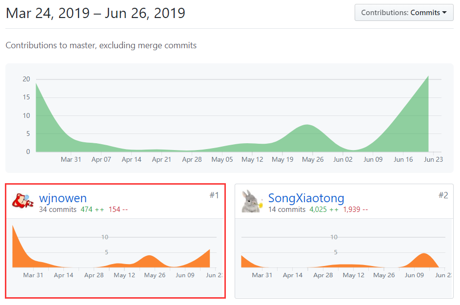

# 个人报告

## 个人信息

学号：16340214 

姓名：王嘉楠

Github：[wjnowen](https://github.com/wjnowen)

## 项目内容
这次系分的项目内容是做一个叫做挣闲钱的云平台。挣闲钱是大学生通过做任务挣钱的云平台，它属于以运营为中心的服务软件，也可以理解为面向大学生的专业“众包”系统。

我们的产品名称是Time is Money（T.I.M），是一款专为大学生设计的任务驱动的C2C在线应用。其中，作为任务的发布者与接收者，用户可以通过指定行为进行收益的赚取与社交的展开。T.I.M主要支持用户任务的发布与接收行为，其中，任务类型主要分为问卷与跑腿。问卷功能主要针对用户信息征集的需求，发布者可以根据自身需要发布一定数量的有价值问卷，系统根据问卷发布时间进行填写者的征集。参与者完成问卷后即可获得对应收益。跑腿功能针对用户对于代购、代签、代取等行为的需求，发布者根据实际情况发布跑腿任务，每个跑腿任务最多征集一名参与者，成功接单者完成后可获得相应收益。

Time Is Money面向所有高校生，是一个为广大高校生群体提供快速兼职的平台。用户可以发布任务获取便利，也可以完成任务获得赏金，平台将会保证每一个任务的真实性、可靠性。因为客户群体均为高校学生，所以我们将采用实名制度，锁定客户的所在院校，为每一个用户提供本校或附近的合的任务，最大程度保证用户的体验。平台将不收取任何中间费用，也不做交易赏金抽成等，是一个全免费应用平台，着力于为高校学生提供安全、可靠、便利、低成本的校园兼职。

## 个人总结

TIM是我在大学学习中做过的最正式和最完整的一次项目，从初期的需求讨论，期间的每次会议和软件的周期迭代，每个应该有的步骤都很完整。这次的项目不仅让我了解了软件迭代的生命周期，也系统地学习了各种文档的编写以及UML图的绘制，让我了解到一个软件的开发不仅仅是代码，软件开发中的每个步骤和细节都至关重要。

在整个项目开发中，我担任的角色是PM（产品经理），也算是第一次体验了对一个完整的项目开发进行管理。原本我觉得产品经理是相对比较容易，比较轻松的任务，结果通过亲身感受后才知道，产品经理也有很多的事情，比如功能设计，需求设计，还有一些文档的编写，同时还要及时沟通各个方向，协调项目的工作，把控工作进程。所以产品经理还是需要较高的能力才能胜任，而我也意识到了自己离一个合格的产品经理还有着很大的距离。不过这次的体验让我学习到了很多，例如如何管理一个开发团队的工作进展，如何编写一些相对比较专业的文档，这些都对我的能力提升有很大帮助。

在开发过程中也让我清楚地认识到了如何站在用户的角度来考虑开发问题，软件的开发绝不能站在开发者的角度上想当然得进行，要多考虑用户的使用感，以提升用户的体验 为目标。其次，各种UML图的绘制，例如用例图，活动图，时序图等等，在进行TIM项目之前，我一直认为这些图的存在都是可有可无的，但是在项目开发过程中，我发现用例图能够帮助数据库构建，而时序图则已经体现了一个程序的运行过程，程序员完全可以根据给出的时序图完成程序的编写，因此这些UML图在程序开发中确实有非常大的作用，对于未来真正开发项目会有很大帮助。这些文档的编写都比较繁琐和复杂，我也真切地感觉到了开发软件的不容易。

说到文档的编写，其中有几篇文档当时写的我是头皮发麻。首先就是测试文档，这个其实不算很难了，但是作为一心想要向标准靠拢的产品，就很想写一份很正规的测试文档。那么正规的测试文档要有风险预测，然而上个学期学的信息安全中的内容都忘了差不多了，所以从头开始学习版本风险的内容，然后又根据项目的情况提出了风险预测。之后还要进行测试内容的确定，设计测试场景和样例，所以测试文档也花费了我不少的时间。其次是前期调研文档，这个文档中比较复杂的部分是竞品分析。竞品分析是很重要的一部分，因为它会决定我们的产品的方向走势，最终对整个产品的竞争力产生影响。所以在选择竞品的时候我还是挑选了很久，最终选择了问卷星和斗米兼职对应问卷和跑腿功能。美团牌跑腿也是个不错的竞品选择，但是因为它没有自主发布任务，自主接受任务的功能，所以我认为斗米兼职更适合作为TIM的竞品分析。还有就是架构文档，也就是软件设计文档。这个文档是我认为最难的一个文档了。这个文档包括技术选型、架构设计、软件设计技术的内容，以及构架可视化的逻辑视图、物理视图等。文档的内容比较复杂而且繁琐，要想写的相对专业是很不容易的。这个文档也花费了我很多的时间，而且也和后端合作才完成的。整个项目中还有很多的文档，大多数都是由产品来做，所以工作量还是很大的。通过编写这些文档，我深刻体会到了每个工作都是不简单的，也感觉到了真个项目的开发工作是很庞大而且复杂的。

在项目的工作中还遇到了一些别的困难，如把握不好项目的进度，布置任务的量不合适等。我们的项目本来预计在17周就结束的，结果发现到了时间后项目的收尾工作还没有做完，一些测试和验收都没有进行。在kanban中可以看到，我们在项目的前期和起步阶段中，任务布置的很少，大家往往都可以按时甚至提前完成，但是到了后面的一个月，我们每周的任务都会剩下一大部分，只能在下一周中继续做。这个就是对项目的进度和组员的任务把握不恰当导致的，所以要成为合格的产品经理还有很多事需要学习。

这次的项目周期很长，对于项目开发中的每个细节我们都经历了一遍，这些经历对我的帮助和提升很大。在整个开发中，通过不断对新的知识进行学习，也让我对整个项目的构架和开发有了更全面的认识。

## PSP2.1表格

\ | Personal Software Process Stages | Time (%)
---|---|---
**Planning** | **计划** | 10
estimate | 预估任务时间 | 10
**Development** | **开发** | 65
analysis | 需求分析 | 15
design spec | 生成设计文档 | 15
estimate | 设计复审（与前端团队成员审核设计文档） | 5
coding standard | 代码规范 | 5
design | 具体设计，包括绘制 UI，设计架构等 | 10
coding | 具体编码 | 0
code review | 代码复审 | 0
test | 测试（修改代码） | 15
**Report** | **报告** | 25
test report | 测试报告 | 10
size measurement | 计算工作量 | 5
postmortem & process improvement plan | 每次迭代结束后写总结文档，并提出改进计划 | 10 

## 个人GIT总结

## 工作清单
#### 产品设计
·制定产品方向

·确定产品形式

·项目愿景文档

·建立产品原型

·架构设计文档

#### 需求设计

·产品需求方向

·个人中心需求设计

·跑腿模块需求设计

·产品需求文档

#### 项目前期调研

项目调研设计

·进行市场调研

·选择竞品并分析

·产品调研文档

#### kanban管理

·通过kanban制定每周项目进度

·通过kanban向每个小组布置任务

·根据每周完成情况制定下周任务量

·统计里程碑与产品进度

#### 项目迭代设计

·大熊座迭代设计

·天枢座迭代设计

·天璇座迭代设计

·摇光座迭代设计

#### 产品测试

·问卷模块测试设计

·问卷功能测试内容

·跑腿模块测试设计

·跑腿功能测试内容

·测试文档

·产品验收

## 特别致谢

特别感谢产品+前端的宋主席（@SongXiaotong），带领我们完成项目！

特别感谢前端组（@yezo13，@SongXiaotong），后端组（@JanKingWon、@wushangjing），撑起了我们整个项目！

特别感谢UI设计师（@moko-momo），让我们的产品特别好看！

特别感谢产品同伴（@Sunheming123），编写文档稳！

## 个人博客

[16340214-如何编写测试文档](https://blog.csdn.net/wjnowen/article/details/93796067)

