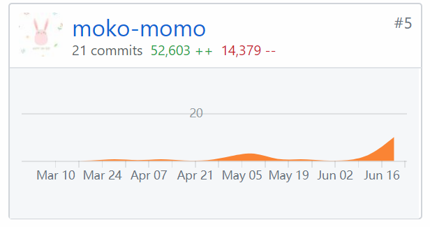
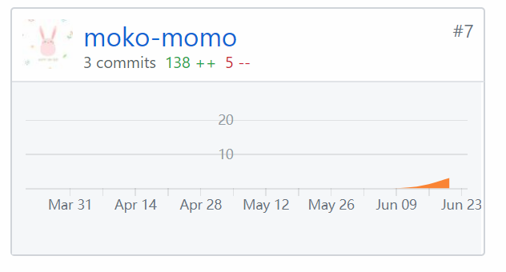

# 挣闲钱项目 个人报告

16340188 邵星语

## 个人简短小结

​	本次实验中，我主要负责了UI和部分前端。虽然UI不是什么技术活，但要做到美观还是有一定难度的。虽然之前在宣传部跟社团有过设计海报等的经验，也有自己做过网页的UI，但比较整体的界面设计还是第一次。设计时不仅仅是美观的问题，还要考虑到与主题的切合度、适宜人群等。从选取主题色开始，到完整的页面设计，全部都是从零开始一步步完成的。

​	作为UI设计师，与产品及前端的交流非常重要。一方面要明白需求才能对界面进行设计，有时候还要对不合理的需求提出意见和改进，对界面的设计负责。另一方面，要让前端大佬们充分理解自己的设计，才能真正将设计实现出来。前期主要使用Axure制作原型，而后将原型上传后请前端进行实现；制作了大部分原型之后，由于项目进度的问题，就直接参与进了前端的工作。前端使用的主要是vue，也临阵磨枪学了一点，编写了一部分界面样式和简单逻辑的代码。

​	最后UI要进行多处调整，很多界面并不是说设计后就理所当然的确定了，会在调整中不断改进，这也是项目迭代的一部分。总体来说，UI界面的设计并不是太难的技术活，但设计能力确实是不能强求的，这也要感谢之前有一些设计的基础，也算是为项目的形象做出了贡献。除此之外，一些前端页面的完成也让我复习了一下html和css，并对vue有了一些了解。

## 统计

| \                                     | Personal Software Process Stages         | Time (%) |
| ------------------------------------- | ---------------------------------------- | -------- |
| **Planning**                          | **计划**                                 | 5        |
| estimate                              | 预估任务时间                             | 5        |
| **Development**                       | **开发**                                 | 83       |
| analysis                              | 需求分析                                 | 15       |
| design spec                           | 生成设计文档                             | 5        |
| estimate                              | 设计复审（与前端团队成员审核设计文档）   | 5        |
| coding standard                       | 代码规范                                 | 3        |
| design                                | 具体设计，包括绘制 UI 等                 | 30       |
| coding                                | 具体编码                                 | 10       |
| code review                           | 代码复审                                 | 5        |
| test                                  | 测试（修改代码）                         | 5        |
| **Report**                            | **报告**                                 | 12       |
| test report                           | 测试报告                                 | 5        |
| size measurement                      | 计算工作量                               | 2        |
| postmortem & process improvement plan | 每次迭代结束后写总结文档，并提出改进计划 | 5        |

## 主要工作清单

- 产品UI原型的设计

  由于这是我第一次接触原型，之前一直以为原型的设计仅限于使用简单模块构造简单功能等，这次实际操作了Axure才了解到，原型图软件也是可以进行UI设计的，并且使用起来非常方便。它包括了颜色、样式、动画等的调整，调整的简便也为初步修改样式时带来了很大的便利性。

- 素材的采集与设计

  很多时候设计需要多看别人的设计成品，并不是为了抄袭或照搬，而是为了从中获取设计的思路和灵感。为了设计一些页面的版式（诸如首页、标题栏等），我浏览了大量国内外的优秀设计网站，这其中还包括美团、问卷网等一些与我们设计功能有接近之处的网站。平日里司空见惯的网站，现在留意观察它的构造，才发现原来还有这么多不简单的地方。

  同样我也参考了很多设计类网站，如pinterest、花瓣等，这些网站也为我的设计带来了很大的帮助。设计素材时仍旧使用我惯用的PS，也取得了不错的效果。

- 前端样式的修改与居中

  要把原型真正实现出来并不是一件容易的事，时间久没有使用css，连一个简单的垂直居中都要调整很久。这个过程是一个不断复习、学习的过程，常见元素和属性等都随着代码的不断增加而变得熟练了。

## 相关贡献

- 项目代码贡献

  

- 文档贡献

- 

## 个人博客清单

## 特别致谢

- 感谢组里的产品大佬们，产品从需求到设计到文档等等都负责了非常多辛苦的任务，作为与产品对接的UI，没有产品大佬们的需求设计UI是做不下去的
- 感谢前端大佬们对项目的支持，UI做了一些动画等等要求也都很精准的实现出来了，没有前端大佬们项目最后没法呈现出与设计一致的结果
- 感谢后端大佬，后端大佬们让项目能够运行起来，技术含量很大，辛苦了！