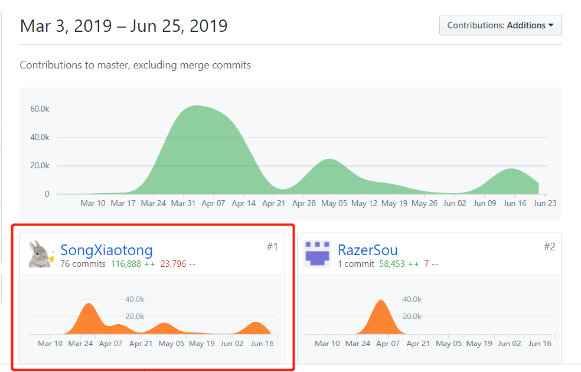
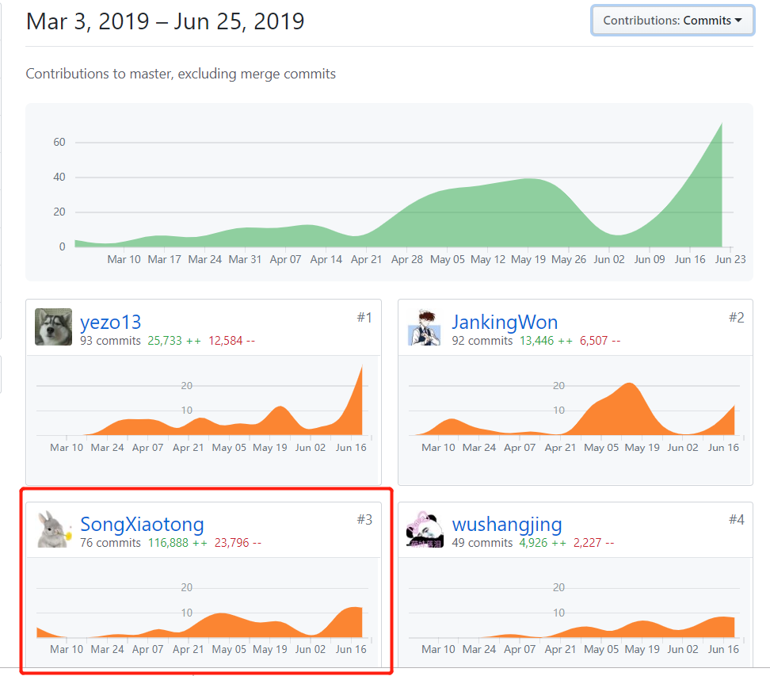
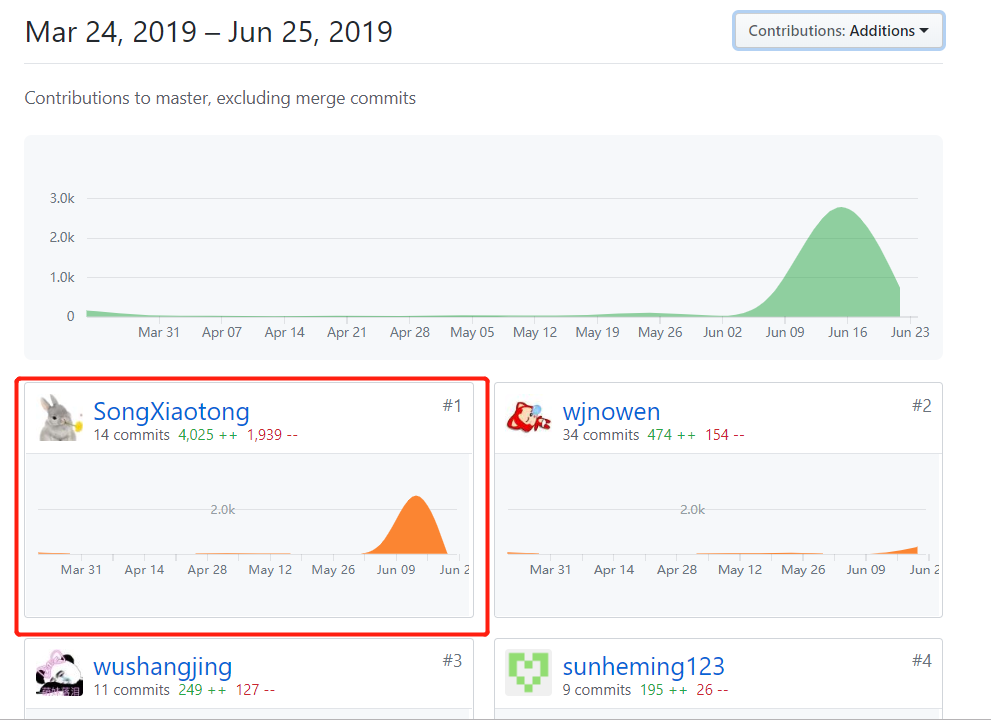
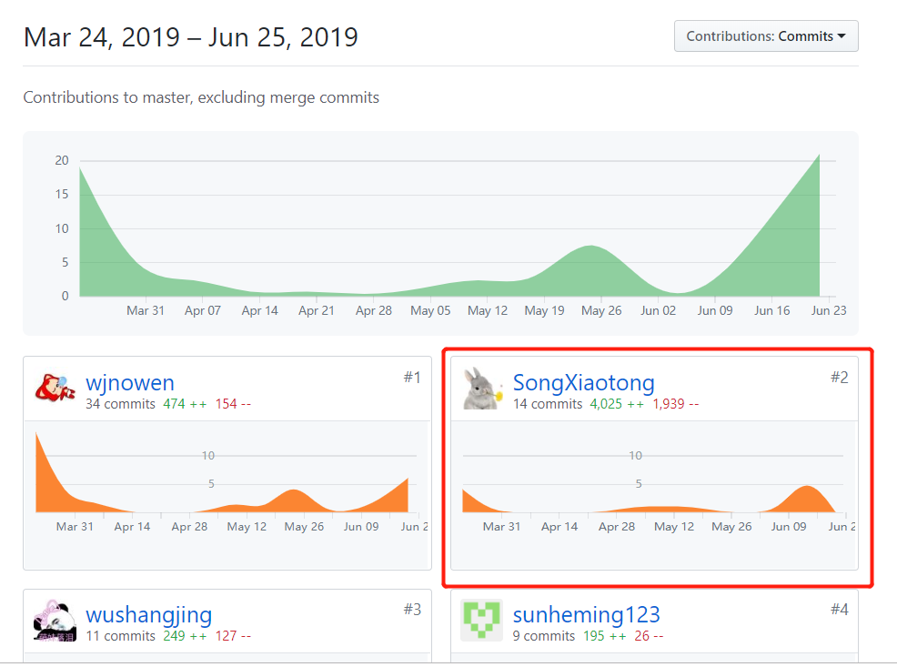

# 16340192-Suata-个人报告

## 个人简短小结

在这次项目进行的过程中，我主要承担的是产品经理和前端工程师的角色。其实一开始本来是只做产品经理的，但是因为前端人员分配的问题，真正在前端工作的只有一位同学，所以我就加盟一起去打前端了。

整个过程不说呕心沥血吧，但是我个人觉得还是挺不容易的，毕竟我专业是个做策划的，除了web2.0课程的学习之外，就只有三次做前端的经验了，所以这次竟然突然扛起大锅来做前端，甚至还圆满完成了任务这是我没想到的！

以下是我主要负责的工作：

### **项目管理**

- 组织团队例会
- 管理迭代进度等

### **产品设计**

- 设计产品功能与需求
- 设计产品交互逻辑等

### **前端开发**

- 开发首页、问卷页、跑腿页、通知页、个人中心下拉制作
- 完成组件模块化设计
- 编写前端规范等

回想起来这段经历我觉得真的是“繁忙与充实”，更多的也是受益匪浅，不仅增加了产品设计的阅历，更是充实了很多的前端知识，很感恩能有这样的机会和团队一起完成这样一个系统的项目。

## PSP 2.1 统计

| 分类 | 工作               | Time（%） |
| ---- | ------------------ | --------- |
| 前端 | 排版着陆页下方介绍（vue） | 1 |
|  | 开发首页模块（vue+vuex+api） | 5 |
|  | 开发问卷模块（vue+vuex+api） | 28 |
|  | 开发跑腿模块（vue+vuex+api） | 10 |
|  | 修改个人中心（vue） | 5 |
|  | 书写前端代码规范   | 1 |
|  | 系统设置优化       | 10 |
| **前端** | **总计**           | **60** |
| 产品 | 需求分析与设计（团队共同） | 10 |
|  | 功能需求文档撰写（问卷部分） | 5 |
|  | 项目文档——about（除迭代部分） | 3 |
|  | 项目文档——需求规格说明书（全部） | 15 |
|  | 项目文档——用例设计（全部） | 6 |
|  | 项目管理——组织会议与迭代安排 | 1 |
| **产品** | **总计** | **40** |

## 主要工作清单

**最有价值的工作**：由于我们团队具有前端经验的成员几乎没有，而我同时作为项目管理者又不得不对项目的进度负责，所以我在一周内学会使用vuex以及api调用与编码方法，率先完成首页与问卷的前端编码部分，将前端的界面编写与交互逻辑工作提上日程，系统前端开发以及与后台对接的任务才渐渐步入正轨，我认为这是我在团队中做到的最有价值的工作。

**最得意的工作**：最得意的工作其实是牵头把前端工作和产品的工作都做得比较完善，作为一个有一点产品设计经验、前端开发经验基本没有的小白，我认为我能够作为项目负责人把这个产品开发出来是十分成功的了（也要感谢团队成员的支持与包容）。

**最有苦劳的工作**：最有苦劳的工作其实应该是制作需求规格说明书的时候，整个需求规格说明书的每一幅用例图、活动图、领域模型等等都是每天熬到很晚一条线一条线画出来的，感觉那段时间画了好多的图，每天都在和图挣扎，甚至一整天都没有吃饭一直坐在电脑前面打代码写文档。

## 个人git总结

### 代码工程库贡献

### 项目文档库贡献

## 个人博客清单

[以QQ为例解读尼尔森十大交互设计原则](https://songxiaotong.github.io/2019/06/26/production/#more)

[超级简单易懂的Vuex入门使用指南](https://songxiaotong.github.io/2019/06/27/vuex/#more)

## 特别鸣谢

- 感谢我的前端队友梓豪和UI设计师+前端队友莫哥，梓豪把着陆页动画和登录注册逻辑完成得特别完善，又是莫哥作为UI设计师修改我和梓豪写的代码样式，现在的系统界面才能这么漂亮，后期我去肝项目文档的时候也是麻烦莫哥做个人页和余额的显示，梓豪也在做最后的测试，十分感谢！
- 感谢后台大佬阿里建和超强，作为一个前端+产品，多亏两位后台大佬如此包容地听我各种加需求各种求api（一直在加需求要api的我在此表示不好意思），虽然合作的过程很艰辛但是最后的成果显然是很不错的，多亏了两位大佬对我这个需求怪的包容和支持[捂脸]！
- 感谢产品两位小伙伴嘉楠和鹤鸣，两个小伙伴在日常会议管理、kanban管理还有最后项目文档的撰写上帮助了我很多，尤其是最后的项目文档，在我被图困扰的时候多亏了两位才能顺利完成文档，如果没有两位产品小伙伴一起完成产品的工作，可能这个项目就完不成了。
- 特别鸣谢李杰泓同学！作为一个前端小白，我经常遇到各种难以解决的坑，每当这个时候我就会向杰泓大佬取经，虽然杰泓大佬不是我们组的成员，但是他每次也都是非常耐心地为我解答，节省了我很多的时间也教会了我很多知识，真的是非常非常感谢杰泓大佬的帮助啊！
- 最后，请允许我再次对以上善良的人儿们表示我最崇高的谢意！因为有大家的团结和友好，这个项目才能顺利完成！也十分感谢大家对我的谅解和包容！完结撒花~