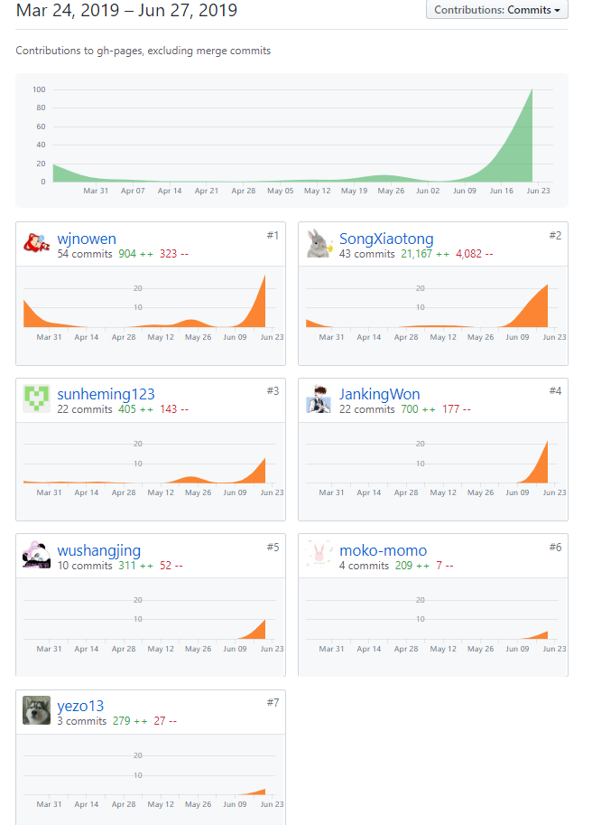
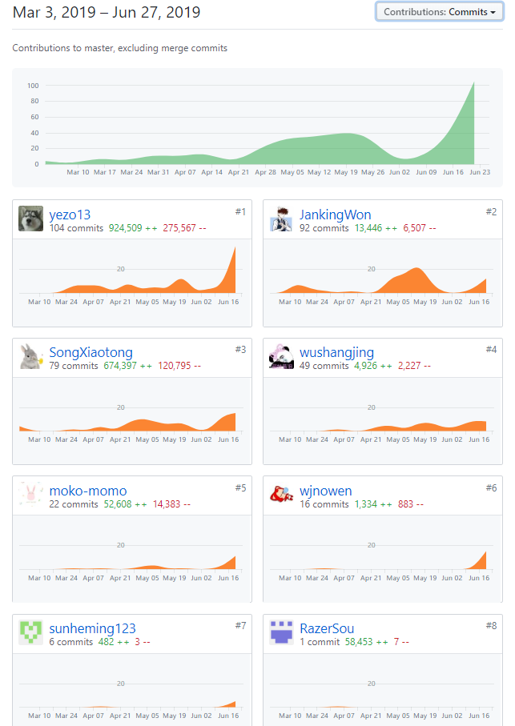

# 小组总结

## PSP2.1 汇总表

/ | 宋晓彤 | 王嘉楠 | 孙鹤鸣 | 邵星语 | 叶梓豪 | 蘇依晴 | 王建 | 郑超强
---|---|---|---|---|---|---|---|---
源代码 | 20% | - | - | 15% | 20% | 5% | 20% | 20%
UI | - | - | - | 100% | - | - | - | -
前期调研 | 15% | 15% | 15% | 10% | 15% | - | 15% | 15%
需求规格 | 30% | 35% | 35% | - | - | - | - | -
架构设计 | 40% | 40% | 20% | - | - | - | - | -
详细设计等 | 10% | 10% | 10% | 10% | 20% | 5% | 20% | 15%
其他 | 10% | 10% | 10% | 10% | 20% | - | 20% | 20%

## 项目所有仓库贡献图表截图

## 综合贡献度分配

学号 | 姓名 | Github | 岗位角色 | 贡献率
---|---|---|---|---
16340192 | 宋晓彤 | SongXiaotong | 项目经理/js工程师 | 16%
16340214 | 王嘉楠 | wjnowen |产品经理 | 10%
16340197 | 孙鹤鸣 | sunheming123 |产品经理 | 10%
16340188 | 邵星语 | moko-momo | UI设计师/js工程师 | 14%
16340277 | 叶梓豪 | yezo13 |js工程师 | 15%
16340196 | 蘇依晴 | RazerSou |js工程师 | 1%
16340215 | 王建 | JankingWon |java工程师 | 17%
15331419 | 郑超强 | wushangjing |java工程师 | 17%

## 小组工作内容

### 人员责任划分

| 人员   | 方向      | 职责                           |
| ------ | --------- | ------------------------------ |
| 宋晓彤 | 产品/前端 | 项目管理 + 前端开发 + 文档编撰 |
| 王嘉楠 | 产品      | 产品设计 + 文档编撰            |
| 孙鹤鸣 | 产品      | 产品设计 + 文档编撰            |
| 邵星语 | UI        | 原型设计 + 前端样式代码修改    |
| 叶梓豪 | 前端      | 前端代码 + 项目线上部署        |
| 苏依晴 | 前端      |                                |
| 王建   | 后台      | 后端代码 + 服务器部署          |
| 郑超强 | 后台      | 后端代码 + API编写             |

### [时推表](https://shimo.im/docs/mriG1uve9ngy0rRp/)

| 周   | 前端                       | 后台                   | 产品                     | UI                                   | 目标         |
| ---- | -------------------------- | ---------------------- | ------------------------ | ------------------------------------ | ------------ |
| 5    | 确定技术栈                 | 确定后端技术栈         | 功能设计，需求文档编写   | 选取主题色，完成着陆页UI设计         | 建立项目规划 |
| 6    | 完成着陆页部分             | 熟悉SpringBoot         | 绘制类图，制作原型图     | 完成首页UI设计                       |              |
| 7    | 完成首页                   | 建立后端项目           | 绘制用例图，完成基础建模 | 完成问卷UI设计                       |              |
| 8    | 完成问卷部分               | 完成用户部分基本API    | 完成跑腿部分功能设计     | 修改当前前端样式                     |              |
| 9    | 优化问卷编辑部分           | 设计问卷API            | 整理产品文档             | 完成个人中心设计                     |              |
| 10   | 完成个人中心部分           | 完成问卷部分基本API    | 完成跑腿功能设计原型     | 完成跑腿设计                         | 验收问卷业务 |
| 11   | 完成前端收尾，等待api      | 前后端对接             | 补充需求规格说明书       | 完成通知设计                         |              |
| 12   | 完成跑腿部分占位设计       | 优化问卷部分           | 完成通知模块设计原型     | 修改个人中心设计                     | 验收业务2    |
| 13   | 完成通知模块设计           | 开始着手跑腿功能       | 对接完整UI设计，状态建模 | 修改跑腿设计                         |              |
| 14   | 对接跑腿功能后台设计       | 优化工程架构           | 完成个人中心迭代设计     | 修改当前前端样式                     | 验收业务3    |
| 15   | 完善登录/注册功能          | 添加邮件短信验证码功能 | 完成闲钱币系统设计       | 完成首页图片素材制作                 |              |
| 16   | 完成跑腿功能               | 完成跑腿功能           | 编写软件测试文档         | 完善系统主题颜色与风格设计           | 验收业务4    |
| 17   | 优化个人中心，增加历史记录 | 优化跑腿功能           | 完成完整模型uml图片绘制  | 修改个人中心前端设计                 |              |
| 18   | 增加闲钱币系统             | 添加充值支付功能       | 整理文档                 | 参与前端开发完成闲钱币系统设计与开发 | 最终产出     |

